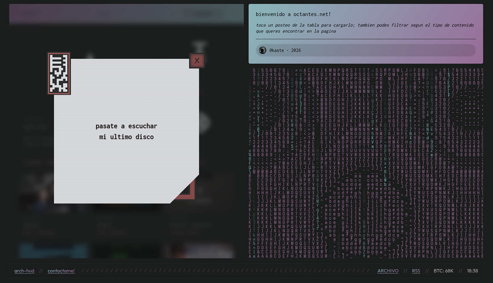

# octantes

**octantes** is a static multimedia web portal and my personal homebase.
No database or dynamic backend dependencies — everything stems from markdown files processed and served as static assets.

Built to centralize production outside of social networks (design, music, writing, dev and games), recovering web fundamentals without algorithms or external rules.
Content is written in plain text and an automated action processes assets, hidrates and builds the final site.

## features

**octantes** is stable and modular, aimed at a zero-friction workflow: drop the markdown and push.

* **mixed architecture**: navigates as a spa with pre-rendered html for indexing
* **bilingual by default**: each post can ship an ingles.md — language detection via navigator.language, instant toggle without reload
* **seo out of the box**: json-ld, opengraph, twitter cards, canonical urls, rss feed and sitemap — all auto-generated from frontmatter
* **asset conversion**: local build step converts images and audio for optimization
* **yaml injection**: system reads md frontmatter to mount specific components
* **flat archive**: parallel generation of a static [archive](https://octantes.github.io/archivo) geocities style version
* **single command build**: npm run build && npm run deploy — full rebuild and rsync to docs/
* **centralized config**: site url and contact email live in a single src/site-config.js file