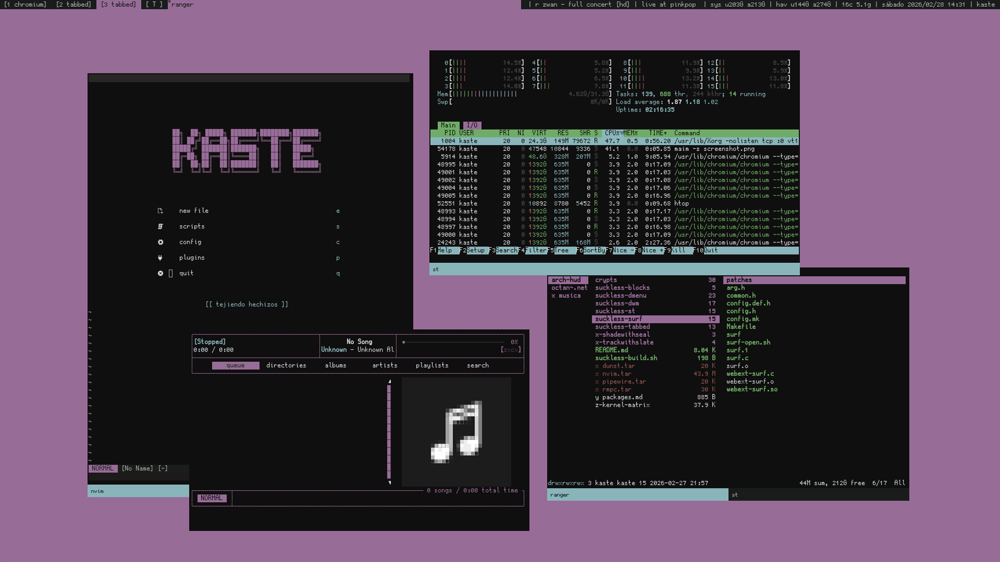

[arch-hud](https://github.com/octantes/arch-hud) es una build personal de herramientas [suckless](https://suckless.org/) para uso diario en arch

las herramientas fueron implementadas pensando en armar un *heads up display*
buscando que la pc vuelva a ser una herramienta y no un agujero negro cognitivo
se implementaron varios parches sobre DWM junto a una estética de estilo retro
sin gaps, transparencia ni compositor por defecto; **sin distracciones innecesarias**

para compilar, entrá en cada dir y ejecutá *sudo make clean install* o usa build.sh

[dwm](https://dwm.suckless.org/) - tiling windows manager
[dmenu](https://tools.suckless.org/dmenu/) - menú de scripts dinámico
[st](https://st.suckless.org/) - emulador de terminal simple
[surf](https://surf.suckless.org/) - navegador muy minimalista
[tabbed](https://tools.suckless.org/tabbed/) - ventanas para st y surf
[dunst](https://github.com/dunst-project/dunst) - daemon de notificaciones

podés sumar el compositor [picom](https://github.com/yshui/picom) si experimentás screen tearing o glitches

| KEYMAP               | FUNCTION                                | CONTEXT       | FROM   |
| :------------------- | :-------------------------------------- | :------------ | :----- |
| WIN + ESCAPE         | quits dwm completely                    | anywhere      | dwm    |
| WIN + TAB            | switches to last opened tag number      | anywhere      | dwm    |
| WIN + NUMBER         | switches to pressed tag number          | anywhere      | dwm    |
| WIN + SHIFT + NUMBER | moves window to pressed tag number      | over window   | dwm    |
| WIN + ZERO           | toggles top bar visibility (fullscreen) | anywhere      | dwm    |
| WIN + BACKSPACE      | kills focused window                    | over window   | dwm    |
| WIN + RETURN         | spawns new tabbed st terminal           | anywhere      | dwm    |
| WIN + SCROLL         | scrolls one line up or down             | over terminal | st     |
| WIN + UP             | increase st terminal text size          | over terminal | st     |
| WIN + DOWN           | decrease st terminal text size          | over terminal | st     |
| WIN + LEFT           | reset st terminal text size             | over terminal | st     |
| WIN + N              | copies text to clipboard                | over text     | st     |
| WIN + M              | pastes text from clipboard              | over text     | st     |
| WIN + Q              | spawns tabbed or tab with nvim          | over tabbed   | dwm    |
| WIN + W              | spawns tabbed or tab with ranger        | over tabbed   | dwm    |
| WIN + E              | spawns tabbed or tab with surf          | over tabbed   | dwm    |
| WIN + R              | spawns tabbed or tab with rmpc          | over tabbed   | dwm    |
| WIN + A              | changes to tiled layout                 | anywhere      | dwm    |
| WIN + S              | changes to floating layout              | anywhere      | dwm    |
| WIN + D              | changes to monocle layout               | anywhere      | dwm    |
| WIN + F              | changes a window to floating            | tiled layout  | dwm    |
| WIN + <              | changes stacked window to master        | tiled layout  | dwm    |
| WIN + Z              | decrease master window amount           | tiled layout  | dwm    |
| WIN + X              | increase master window amount           | tiled layout  | dwm    |
| WIN + C              | changes focus to previous window        | tiled layout  | dwm    |
| WIN + V              | changes focus to next window            | tiled layout  | dwm    |
| WIN + Y              | change focus to previous monitor        | anywhere      | dwm    |
| WIN + U              | change focus to next monitor            | anywhere      | dwm    |
| WIN + I              | moves window to previous monitor        | anywhere      | dwm    |
| WIN + O              | moves window to next monitor            | anywhere      | dwm    |
| WIN + P              | opens dmenu in topbar                   | anywhere      | dwm    |
| WIN + H              | decrease horizontal window size         | tiled layout  | dwm    |
| WIN + J              | increase vertical window size           | tiled layout  | dwm    |
| WIN + K              | decrease vertical window size           | tiled layout  | dwm    |
| WIN + L              | increase horizontal window size         | tiled layout  | dwm    |
| CONTROL + NUMBER     | moves to pressed tab number             | over tabbed   | tabbed |
| CONTROL + BACKSPACE  | kills current tab                       | over tabbed   | tabbed |
| CONTROL + RETURN     | makes current tab fullscreen            | over tabbed   | tabbed |
| CONTROL + H          | changes to left tab                     | over tabbed   | tabbed |
| CONTROL + J          | moves current tab to left               | over tabbed   | tabbed |
| CONTROL + K          | moves current tab to right              | over tabbed   | tabbed |
| CONTROL + L          | changes to right tab                    | over tabbed   | tabbed |
| CONTROL + SHIFT + Q  | opens go to url prompt                  | over surf     | surf   |
| CONTROL + SHIFT + W  | opens web search prompt                 | over surf     | surf   |
| CONTROL + SHIFT + E  | opens find text prompt                  | over surf     | surf   |
| CONTROL + SHIFT + R  | reloads the current page                | over surf     | surf   |
| CONTROL + SHIFT + A  | switch to next find result              | over surf     | surf   |
| CONTROL + SHIFT + S  | stops current page load                 | over surf     | surf   |
| CONTROL + SHIFT + D  | resets zoom                             | over surf     | surfd  |
| CONTROL + SHIFT + F  | switch to previous find result          | over surf     | surf   |
| CONTROL + SHIFT + Y  | navigates backwards in history          | over surf     | surf   |
| CONTROL + SHIFT + U  | zooms page out                          | over surf     | surf   |
| CONTROL + SHIFT + I  | zooms page in                           | over surf     | surf   |
| CONTROL + SHIFT + O  | navigates forwards in history           | over surf     | surf   |
| CONTROL + SHIFT + H  | decreases horizontal scroll             | over surf     | surf   |
| CONTROL + SHIFT + J  | decreases vertical scroll               | over surf     | surf   |
| CONTROL + SHIFT + K  | increases vertical scroll               | over surf     | surf   |
| CONTROL + SHIFT + L  | increases horizontal scroll             | over surf     | surf   |
| CONTROL + SHIFT + N  | copies selection to clipboard           | over surf     | surf   |
| CONTROL + SHIFT + M  | pastes into field from clipboard        | over surf     | surf   |
