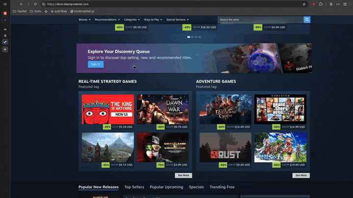
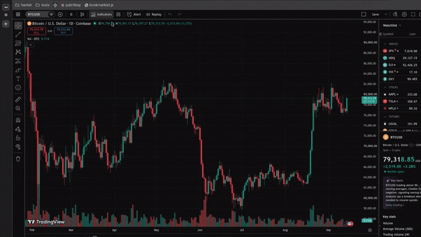
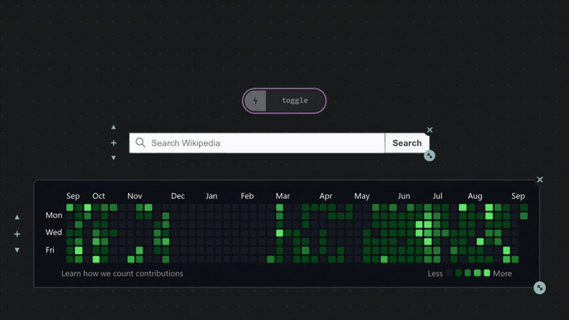
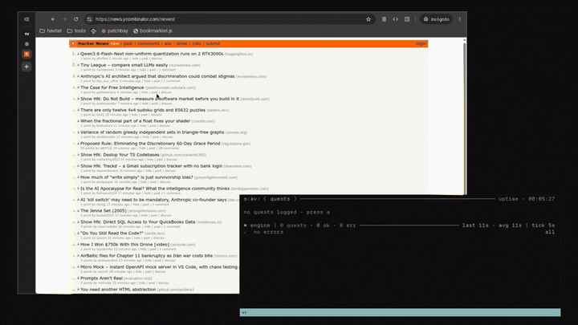
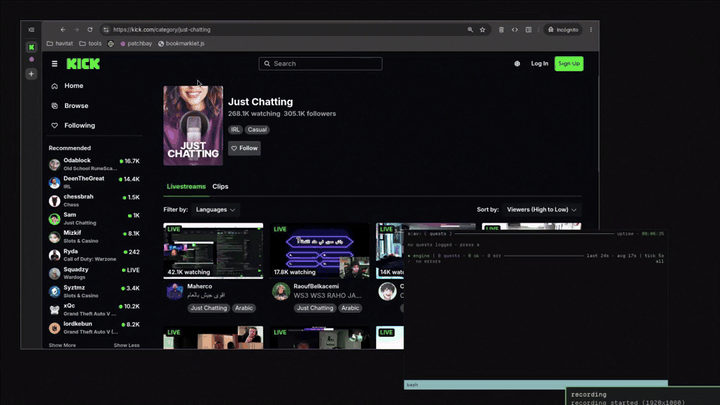

***

*You can find the project repo in my [Github](https://github.com/octantes/scavenger)*

***

```
> Harvest anything from the web and wire it into something new
> Export it as a single html file, use it anywhere and publish it
> UI is a function of state, and in s<av> state is a function of DOM
```



**scavenger is a substrate for portable web tools.** Anything you build with scav becomes portable by definition, exporting into a single, standalone HTML file that works anywhere. No packages, no build step, no framework, no account, and *nothing phoning home* unless you explicitly want it to.

The toolkit has four core primitives, deliberately different in shape because each is the natural form for what it does. **You don't need all of them to build something**, but together they form the complete project.

### The Four Tools

[kernel](https://github.com/octantes/scavenger/blob/main/docs/kernel.md)

The script that you run on any website to harvest components, lift data and run visual debugging tools.



Harvesting is not scraping HTML or taking a screenshot. It **takes a rendered component from a live page and reconstructs it** as an independent Web Component: resolving the styles the browser actually applied, preserving the cascade, responsive units, variables, pseudo-elements, fonts, assets, form state, and relevant layout behavior.

[patchbay](https://github.com/octantes/scavenger/blob/main/docs/patchbay.md)

The runtime, where you place components and wire them, exporting the project as-is into HTML.



[quests](https://github.com/octantes/scavenger/blob/main/docs/quests.md)

The bridge to live external state and data, turning CSS selectors into channels for patchbay to consume.



[compiler](https://github.com/octantes/scavenger/blob/main/docs/compiler.md)

The authoring environment, where you create new logic nodes and components that extend patchbay.



## Philosophy

This project starts from a simple premise: **the browser already is a malleable computational substrate.**

The Document Object Model is not just the representation of an interface; it is a live, addressable state space that the browser knows how to render, mutate, serialize, persist and rehydrate. This leads to a simple model: UI is a function of state, and all **persistent state is a function of the DOM.**

```
htmx says
"don't maintain a second client-side representation of UI
HTML is the representation"

scav says
"don't maintain a second representation of the application
the DOM holds the state"
```

The consequence of this conceptualization is that **the document isn't a rendering of the app, the app is a rehydration of the document.** If state lives in element attributes, values can be serialized into markup, and if the runtime reads the document itself, there is no hidden model to drift out of sync. Saving is a memory dump, the file just boots.

The same property that makes state serialization possible also makes the runtime web **a material you can build from**. The early web itself was built around documents that could be linked, copied, saved, edited and served without asking permission from a platform.

This is still true. The underlying model hasn't changed, but *layers of tooling and growing complexity have obscured it.* We stopped noticing - scav makes those properties apparent and directly usable. What gets distributed to your machine is yours to harvest, rewire and repurpose, and what you build with it can persist as a document.

The modern browser is the closest working approximation of the conceptual model The Memex imagined, Engelbart demoed, and Nelson spent a lifetime writing about: hypertext you author, not just consume. scavenger is less of an invention than a realization that the model is **already here**, installed on almost every personal computer.

The long argument lives in a companion essay - *Artesanías del Runtime* - on the browser as a scavengeable runtime and **the third domain** of tools that only exist there: not CLI, not web app, but local-first visual runtime. (Forthcoming.)