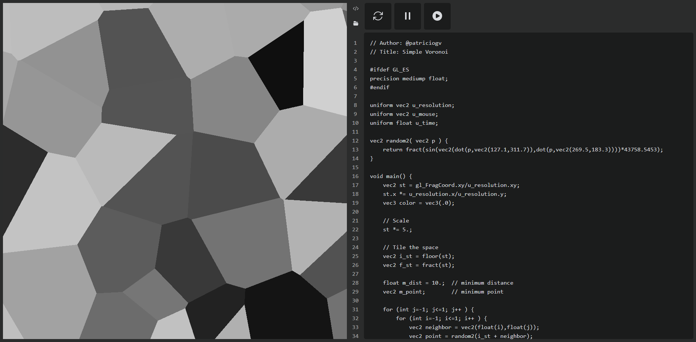

*You can find the project repo in my [Github](https://github.com/octantes/shadewithseal)*

seal is a local tool to **create, save and record glsl frag shaders**
no installation or internet needed: just download the HTML and open it in your browser

built for technical artists who want a lightweight playground to prototype
ideal for those seeking simplicity and privacy: not meant for professional use
however, some important edge-cases are covered to ensure practicality

all information stays on your machine, no accounts, servers or syncs
the data *stays in your browser until you export it* — make regular backups

each release is stable, the goal is to keep it **simple**: open it and code

*live-coding*: program GLSL shaders while seeing results in real time
*rendering*: simple and minimal render-loop based on webGL (currently 1.0 only)
*compatibility*: most of shadertoy's custom variables have been implemented
*recording*: functions to record, play, pause and download the video to webm
*storage*: everything is saved inside the browser cache using indexedDB
*super lightweight*: compatible with any browser, including mobile; only ~100 KB

**wip**: webGL2 > JSON export > canvas overlay + blending modes > aspect ratios

pro-tip: *save it as a bookmark for quick access*
