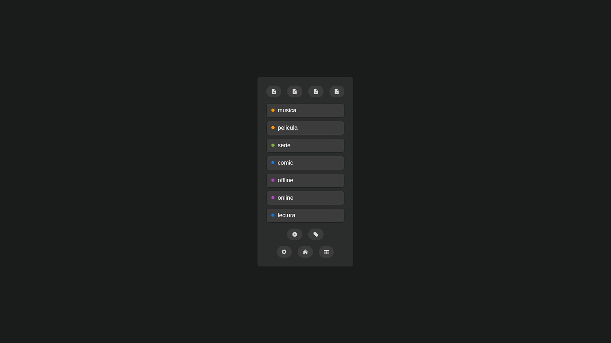

*You can find the project repo in my [Github](https://github.com/octantes/trackwithslate)*

slate is a local webapp to **create, organize and export tabular data** in the browser
no installation or internet needed: just download the HTML and open it in your browser

built to have a lightweight local way to manage data without dependencies
ideal for those seeking simplicity and privacy: not meant for professional use
however, some important edge-cases are covered to ensure practicality

all information stays on your machine, no accounts, servers or syncs
the data *stays in your browser until you export it* — make regular backups

each release is stable, the goal is to keep it **simple**: open it and plan

*import/export*: bring and save your data in CSV, a plain text format
*edit records*: view, modify and sort the table with bulk-delete and fuzzy-find
*category autocomplete*: create buttons to fill entries quickly
*date formats*: auto-fill with the current date in whatever format you want
*storage*: everything is saved inside the browser cache using localstorage
*data types*: define columns with constraints for specific data types
*super lightweight*: compatible with any browser, including mobile; only ~100 KB

**wip**: fields with symbolic subdivisions > dataviz > multiple databases

pro-tip: *save it as a bookmark for quick access*
