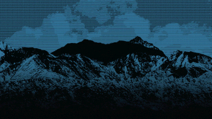
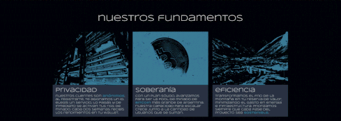
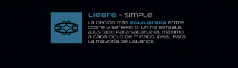
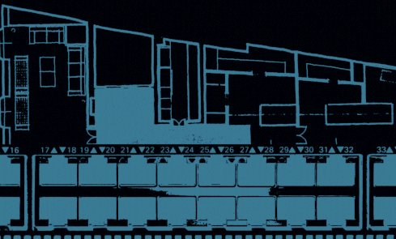

[!TEXT]

cruzar fue mi *segundo* proyecto de diseño basado en identidades de marca ficticias
el objetivo era armarme una excusa para seguir animando y practicando herramientas

en este caso, el concepto se apodero completamente del proyecto, creo que para bien
poner un datacenter *en el medio de la cordillera* es una idea latente en nuestro imaginario
la parte cripto me parece parte de un mismo objetivo, hacer buen uso de nuestro entorno
siento que es cuestion de tiempo para que se de, y ojala que sea un proyecto **argentino**

por las limitaciones de la pagina, es muy posible que los gifs se vean desincronizados

* proyecto realizado usando figma, photoshop y after effects