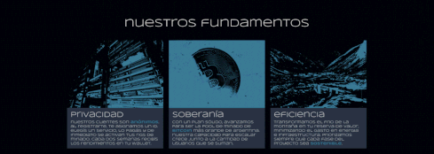
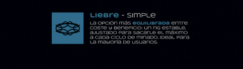

[!TEXT]

cruzar fue mi *segundo* proyecto de diseño basado en identidades ficticias, una excusa para seguir animando

en este caso, el concepto se apoderó completamente del proyecto y creo que le hizo bien al resultado final
me parece que la idea de *instalar un datacenter en el medio de la cordillera* está latente en nuestro imaginario
le sumé el costado cripto porque me parece parte de un mismo objetivo: aprovechar nuestros recursos al máximo
realmente creo que es cuestión de tiempo para que algo así se dé, y ojalá que sea de la mano de un **argentino**

lamentablemente, por las limitaciones de la página, es muy posible que los gifs se vean desincronizados

* proyecto realizado usando figma, photoshop y after effects