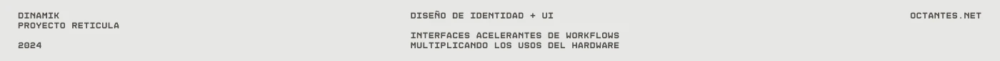
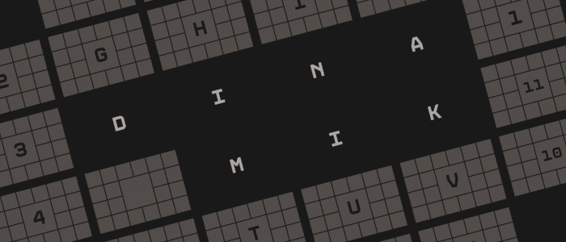
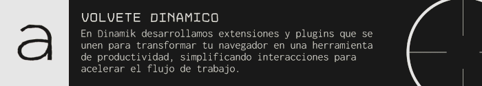
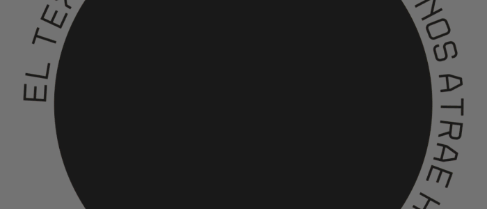
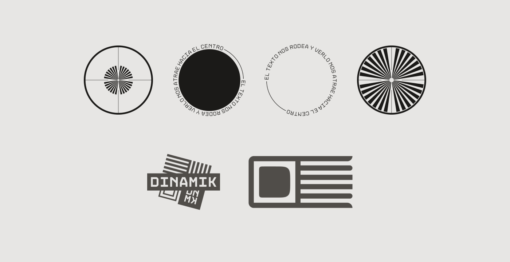
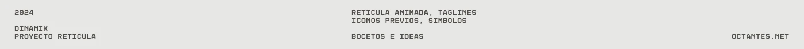

[!TEXT]

dinamik fue mi *tercer* proyecto de diseño basado en identidades de marca ficticias

en este caso, la idea era armar algo **responsive** que se ajuste al tamaño de la pantalla
se me ocurrió pensar este branding para que pueda ser revisitado en proyectos futuros
el concepto final es una empresa que desarrolla software para mejorar la productividad
la estética bebe de la óptica, que sorprendentemente tiene muchísimo atractivo visual

algunos logotipos no terminaron en el proyecto, pero los agregué en la última imagen
el proyecto fue realizado usando figma, photoshop y after effects, entre otras cosas

inspirado en el trabajo de [bn digital](https://www.behance.net/bn_digital), que me parece excelente e inalcanzable