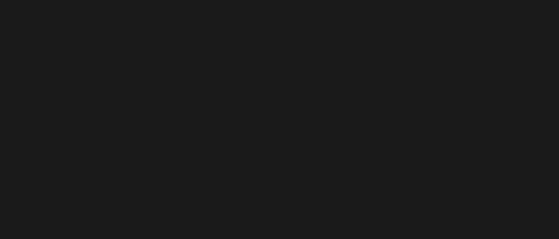

[!TEXT]

la tesis del proyecto es pensar las **secciones** necesarias para presentarlas en dos visores
de esta forma la pagina se mantiene coherente al ser siempre el mismo layout para todo
es importante vincular los proyectos principales a través de notas que aporten contexto
elevando el valor final de la publicación al integrar soportes visuales, referencias y datos

- visor con la presentación del sitio, la navegacion, las novedades y links externos
- visor dinámico de contenido para presentar todos los artículos y los proyectos
- statusbar integrando elementos dinámicos, datos en real time y toggle idioma

el visor de **proyectos** integra distintos layouts según el contenido que debe presentar
se suman funcionalidades exclusivas, como una barra de scroll o el shader de espera

1. asemicdos y sellosiete usan el layout de landing page, integrando sus stylesheets
2. nubenueve usa el layout de nota pero integra los embeds de youtube y de spotify
3. signoseis usa el layout de nota pero sin integrar embeds, con un stylesheet unico