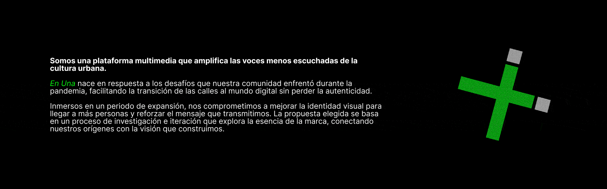
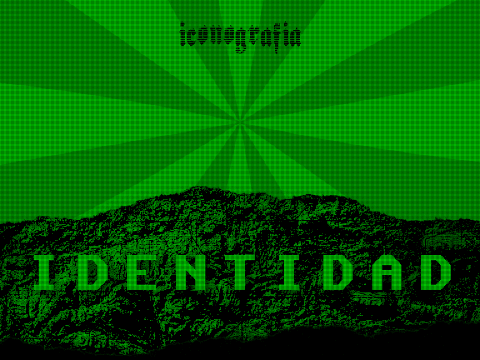

[!TEXT]

este fue mi primer *proyecto* de diseño, después de años haciendo cosas sin profundizar
se me ocurrió pensar pequeños conceptos de marcas ficticias, como excusa para practicar

en este caso, el objetivo era diseñar una identidad y **animarla** usando after effects
para eso, la excusa fue una revista de publicación digital con una paleta muy reducida

hoy en día le veo problemas de espaciado, y el texto del copy me parece bastante básico
me gustaría revisitar esta *estética*, quizás con algún proyecto real que la aproveche

el trabajo fue realizado usando figma, photoshop y after effects, entre otras cosas

inspirado en [cdc comms](https://cultdeadcow.com/about/), los [bumps](https://youtube.com/playlist?list=PL075thqiB6t9FE4pyy-2omH_rZMVhnp77&si=JR1lDU6VWQ2jujj9) de adult swim y las [animaciones](https://www.behance.net/gallery/47393655/Watch_Dogs-2-DEDSEC-Video) de dedsec