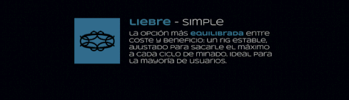
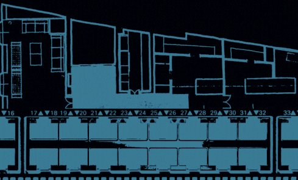

[!TEXT]

buscando que la pc vuelva a ser una herramienta y no un agujero negro cognitivo

cruzar fue mi *segundo* proyecto de diseño sobre identidades de marca ficticias
el objetivo era armarme una excusa para animar y practicar varias herramientas

en este caso, el concepto se apoderó totalmente del proyecto, creo que para bien
poner un **datacenter** en la cordillera es una idea latente en nuestro imaginario
la pata cripto es parte de un mismo objetivo, hacer buen uso de nuestro entorno
siento que solo es cuestión de tiempo, y ojalá que sea un proyecto *argentino*

por las limitaciones de la página, es muy posible que los gifs se desincronicen

proyecto realizado usando figma, photoshop y after effects, entre otras cosas