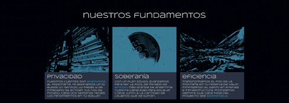
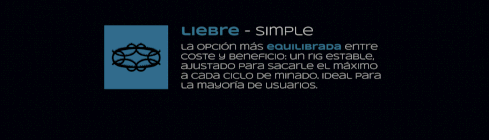
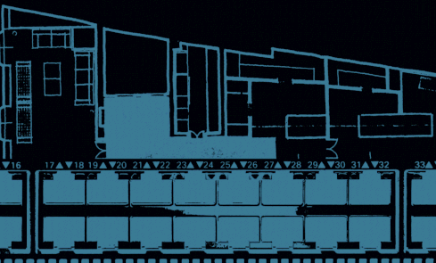

[!TEXT]

cruzar was my *second* design project on fictional brand identities
the goal was to give myself an excuse to animate and practice various tools

in this case, the concept completely took over the project, I think for the better
placing a **datacenter** in the mountain range is a latent idea in our imagination
the crypto leg is part of the same goal — making good use of our environment
I feel it's only a matter of time, and hopefully it will be an *argentine* project

due to page limitations, the gifs might desync

project done using figma, photoshop and after effects, among other things
