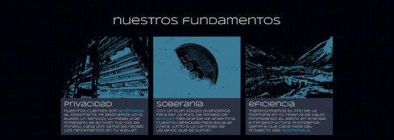
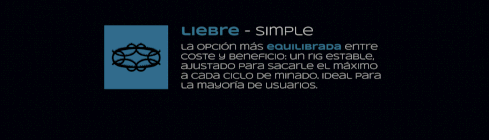
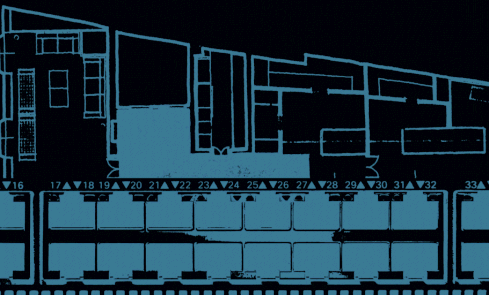
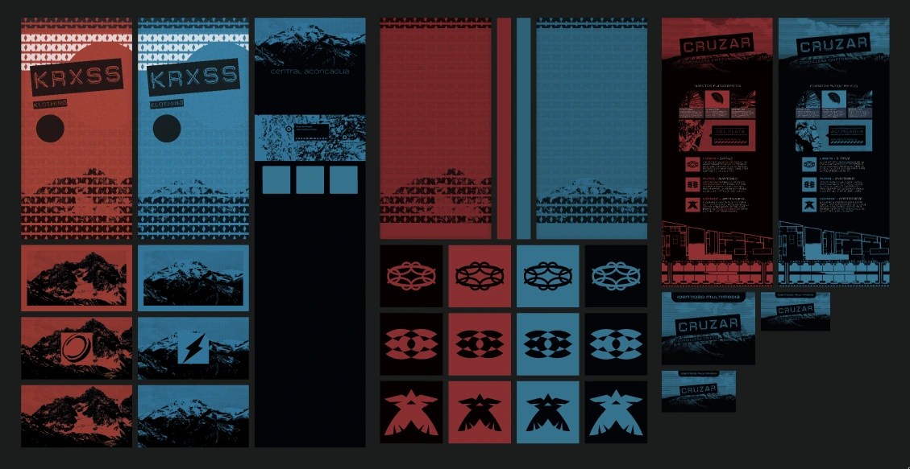
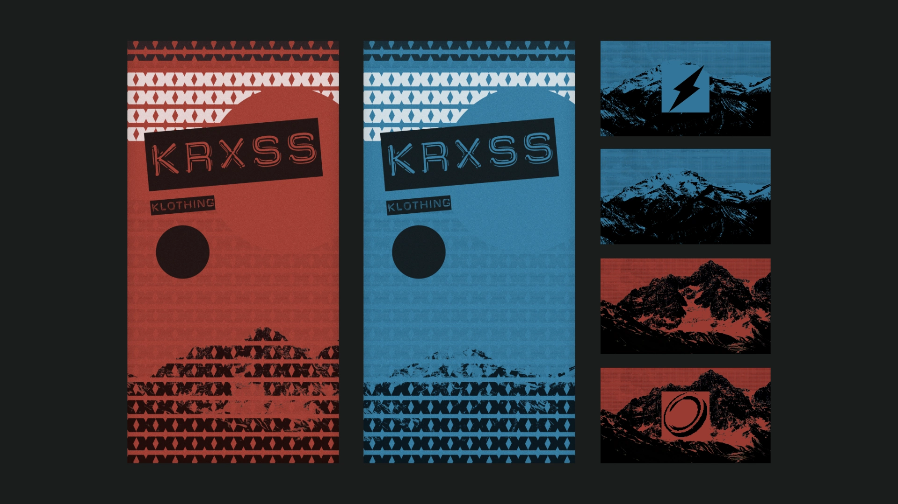
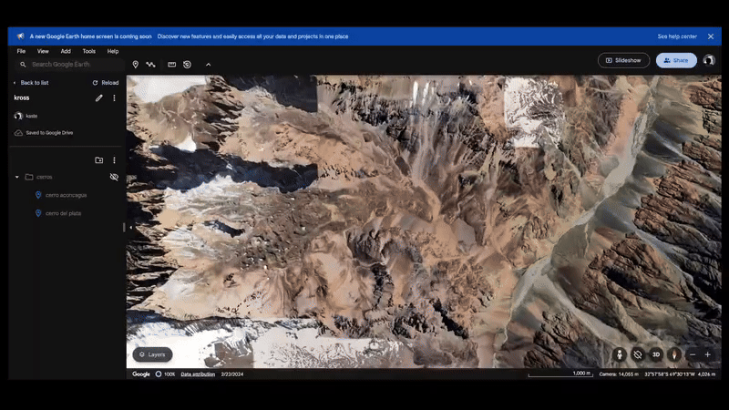

[!TEXT]

***CRUZAR*** is a project building two data centers in the Patagonian mountain range, designed to support AI training, accessible high-performance compute, and Bitcoin mining infrastructure.

The identity had to connect the physical scale of the landscape with the machinery inside it: mountain ranges, satellite terrain imagery, server racks, cables and the constant movement of data. It needed to feel rooted in Argentina while speaking the native language of contemporary infrastructure.

Beyond the facilities themselves, *CRUZAR* is built around a wider idea of computing sovereignty. The project aims to give younger builders access to local compute for their own work, encourage technical experimentation in Argentina, and compound value by reinvesting proceeds back into the infrastructure used for mining and storing Bitcoin.

### Sketches

The starting point wasn't a blank canvas in this case. An unused sketch for a clothing brand already contained several of the raw components *CRUZAR* needed: terrain, texture, and a graphic language with enough movement to become a system.

The work became an exercise in selection. I repurposed the elements that could carry the new project, stripped back the ones tied too closely to the original direction, and introduced new tools to connect the identity to data infrastructure.

### The Map

Satellite imagery needed to be a living part of *CRUZAR's* visual identity, not a fixed background asset. I built a custom system connected to the Google Earth API that automatically exports new, processed animations ready to use across the project.

The export system runs on a local-first server with custom tooling. It supports location updates based on coordinates and automatically generates identity cards that can be exported as static assets or ready-to-use animations.

### Packages

*CRUZAR* needed distinct paths for different kinds of builders, from a first compute or mining setup to fully configured infrastructure. Each package needed enough visual separation to be understood at a glance, while still belonging to the same identity system.

I based the tiers on native animals, turning each one into a rotating 3D object with the feel of a videogame item. The motion gives every package its own presence without breaking from the wider visual language.

**Liebre:** is the entry point: a balanced and lightweight option for early projects, with accessible cost-efficient mining and compute capacity.

**Puma:** is a more advanced tier, built for users who need to configure the setup in greater detail.

**Cóndor:** is the enterprise package, shaped through direct conversation and customized around specific infrastructure needs.

### Presentation

