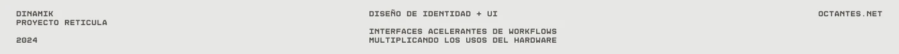
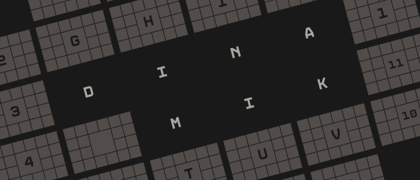
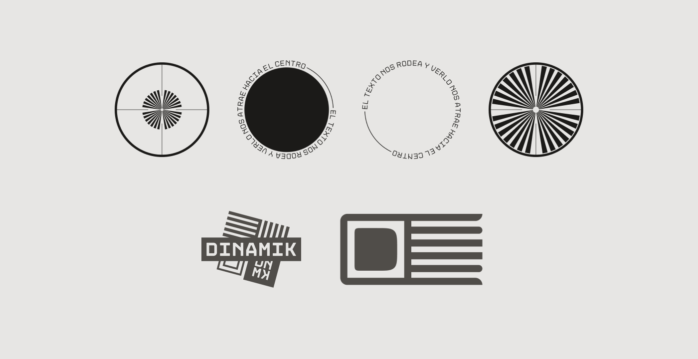
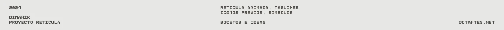

[!TEXT]

dinamik fue mi *tercer* proyecto de diseño sobre identidades de marca ficticias

en este caso, la idea era armar algo **responsive** que se ajuste a la pantalla
se me ocurrió pensar el branding para que sea revisitado en proyectos futuros
el resultado es un estudio que arma herramientas que mejoran la productividad
la estética bebe de la *óptica*, que sorprendentemente tiene mucho atractivo

el proyecto fue realizado usando figma, photoshop y after effects, entre otros

inspirado en el trabajo de [bn digital](https://www.behance.net/bn_digital), que me parece excelente e inalcanzable