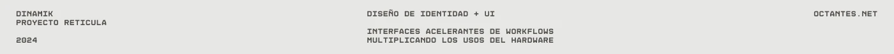
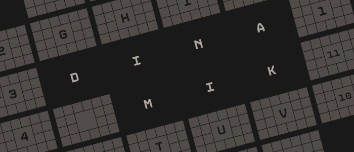
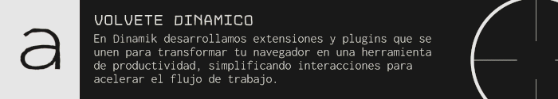
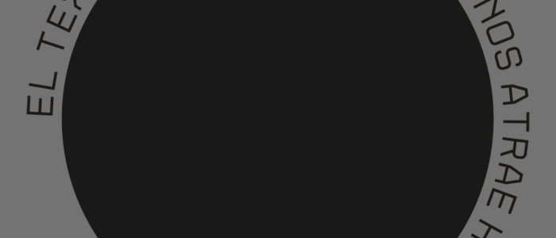
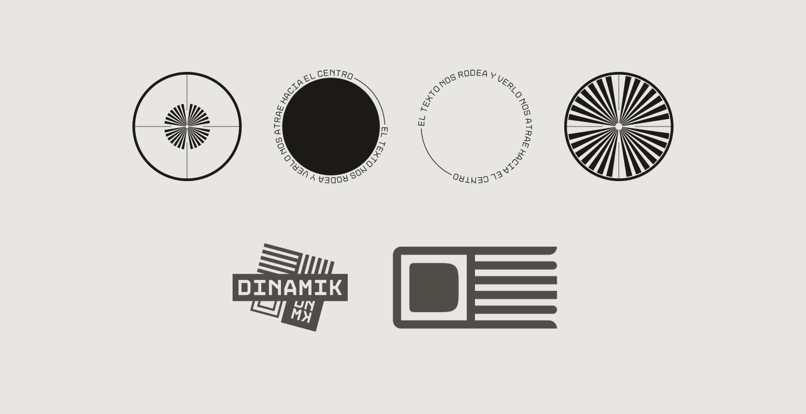
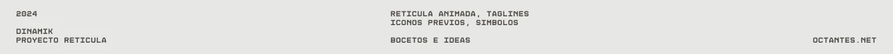

[!TEXT]

dinamik was my *third* design project on fictional brand identities

in this case, the idea was to build something **responsive** that adapts to the screen
i thought of the branding so it could be revisited in future projects
the result is a studio that builds tools to improve productivity
the aesthetic draws from *optics*, which surprisingly has a lot of appeal

the project was done using figma, photoshop and after effects, among others

inspired by the work of [bn digital](https://www.behance.net/bn_digital), which I find excellent and unattainable
