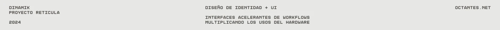
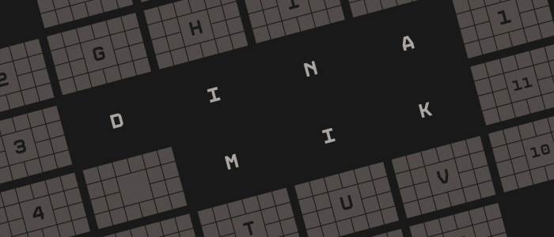
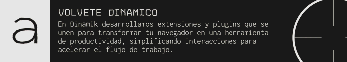
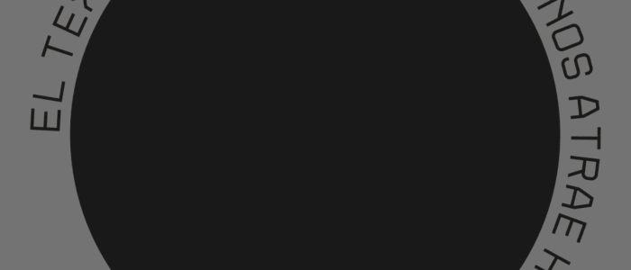
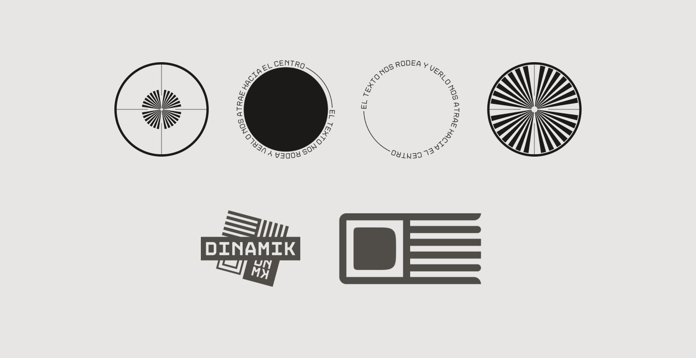
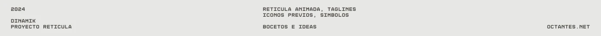
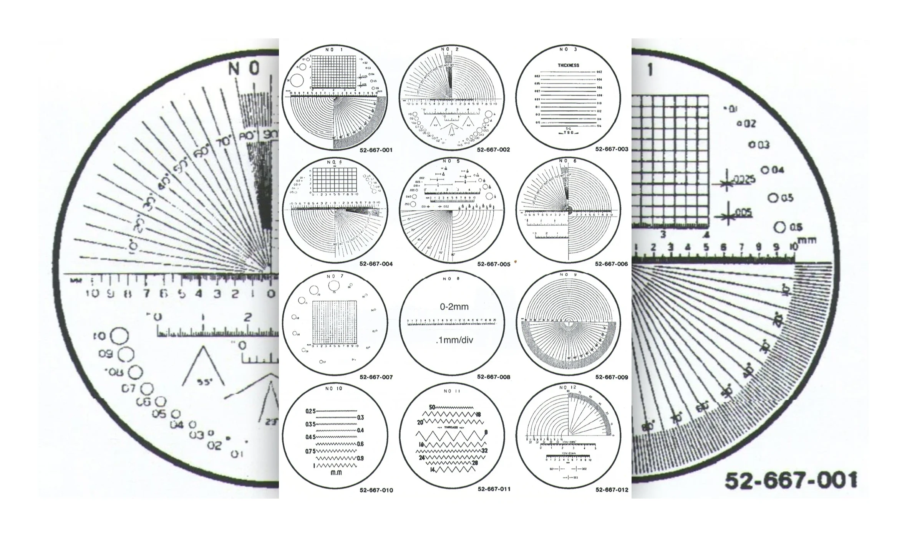

[!TEXT]

***DINAMIK*** is a boutique development studio focused on building precise human-computer interaction systems and UI with extreme attention to detail. They needed an identity that could grow with them as they explored new projects.

The visual system needed to reflect that same discipline: technical, precise, and focused without becoming cold. I built the visual language around the fascinating world of optics, calibration grids, reticles, and responsive interfaces.

### Optics

*DINAMIK* builds systems meant to be used by people, so the identity needed to feel active in the same way. Motion brings presence and warmth to assets that would otherwise remain sterile, making the visual system feel closer to an interface than a fixed brand toolkit.

The *Become DINAMIK* tagline was a long-running phrase the team used to explain their focus: adaptability through multi-domain workflows. They apply a UNIX mindset to create small, interconnected, tactile-feeling tools that do one thing well and compose with the rest.

### Tools

Because the studio creates different tools, each needs an identity derived from the same visual language. ***Reticula***, their first tool, was renamed after the visual concept was approved. It is a radial interface for triggering key macros.

*Reticula* is differentiated by its radial form, so every part of the reticle was built from the ground up. The system carries *DINAMIK's* precision into the interface while allowing for fully customizable motion and animation.

### Presentation

