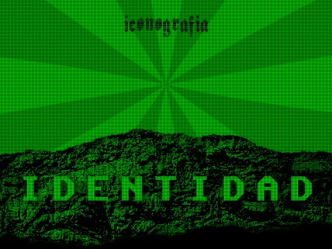
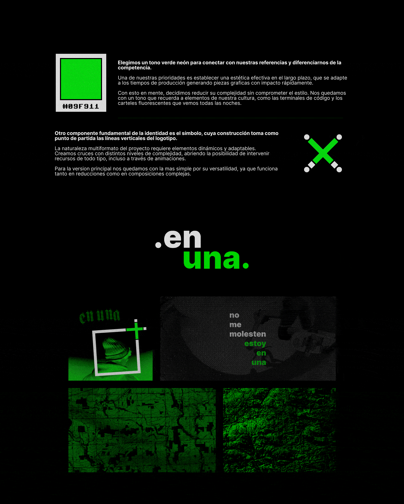
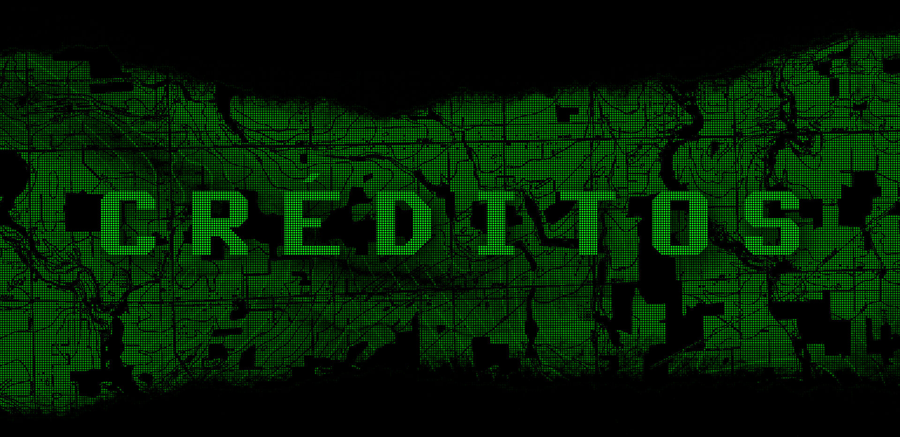
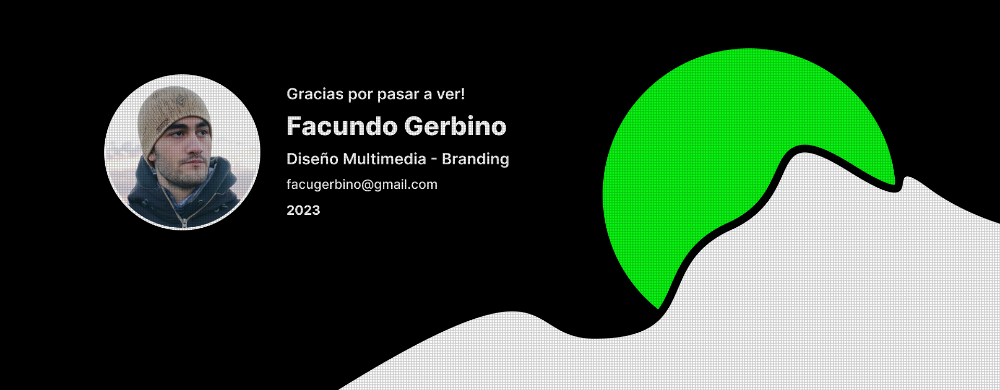
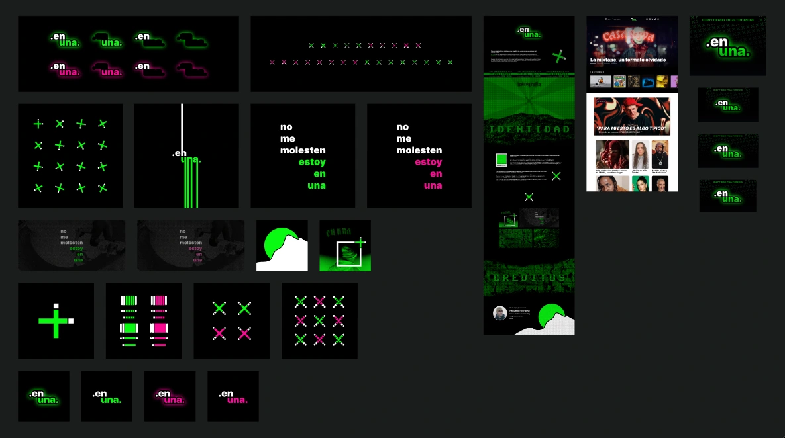

[!TEXT]

***en una*** es una revista digital moldeada por la calle y el internet.

A medida que la publicación pasó de editar fanzines a ser una plataforma multimedia, necesitaba una identidad que pudiera cargar ambos mundos sin reducir ninguno.

Construí un sistema visual alrededor de elementos reconocibles y flexibles que pudieran desplazarse entre el sitio web, contenido editorial, animaciones y posts. Cada pieza necesitaba sostener la misma identidad, dejando espacio para juego, evolución y nuevos formatos.

El resultado se aleja de las estéticas de medios tradicionales y mantiene viva la energía áspera y hazlo tú mismo de la publicación original. Tipografía, textura, composición y animación trabajan juntos para que el sistema se sienta vivo.

### Página

El sitio debía funcionar como una pizarra a medida que el equipo encontraba su voz online: un lugar para testear ideas, cambiar dirección y seguir evolucionando sin reconstruir todo el sistema.

El video vertical se estaba volviendo central al output de la revista, así que el sitio tenía que hacer que ese formato se sintiera nativo. Construimos un sistema flexible que trae los embeds verticales de YouTube a la página, donde se reproducen en hover y conviven con el trabajo escrito y visual de la revista.

El resultado combina la plataforma y su output externo en una única experiencia continua.

### Presentación

