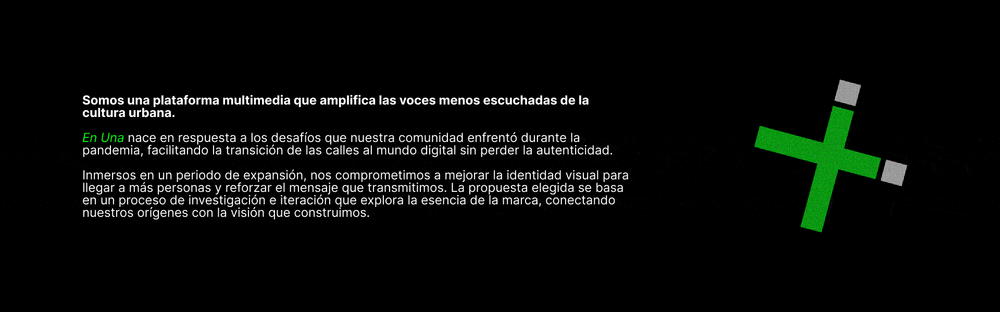
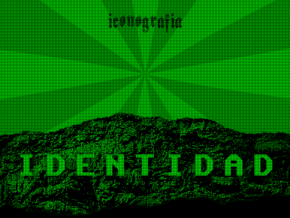
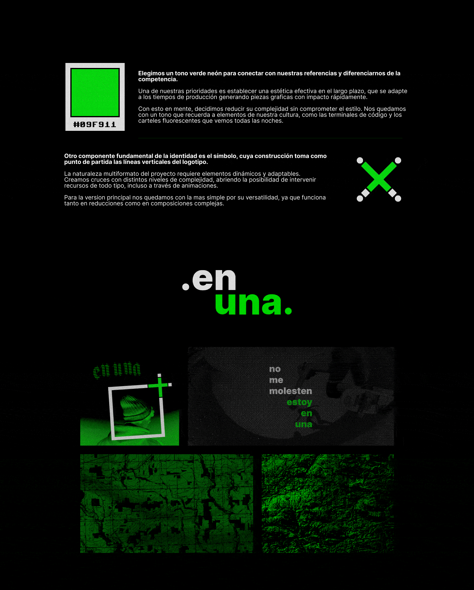
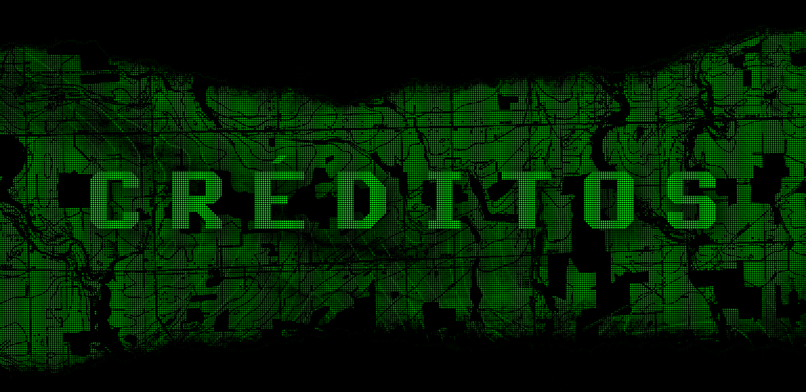
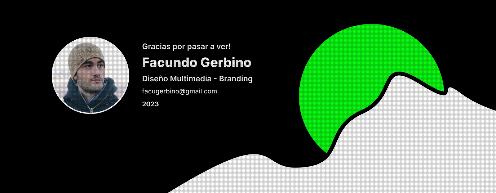

[!TEXT]

this was my first *design* project, after years of not diving too deep
i came up with fictional brand concepts as an excuse to practice

in this case, the goal was to design assets and **animate** them using after effects
for that, the excuse was a digital publication magazine with very few colors
today i see spacing issues, and the copy text feels basic to me
i'd like to revisit this *aesthetic* with a real project that makes use of it

the work was done using figma, photoshop and after effects, among others

inspired by [cdc comms](https://cultdeadcow.com/about/), adult swim [bumps](https://youtube.com/playlist?list=PL075thqiB6t9FE4pyy-2omH_rZMVhnp77&si=JR1lDU6VWQ2jujj9) and dedsec [animations](https://www.behance.net/gallery/47393655/Watch_Dogs-2-DEDSEC-Video)
