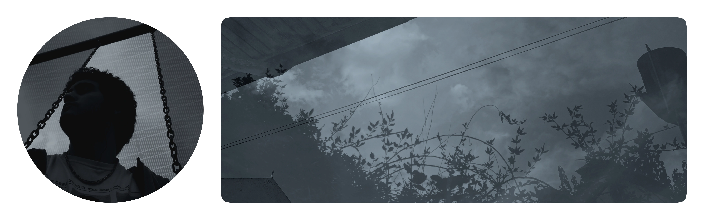
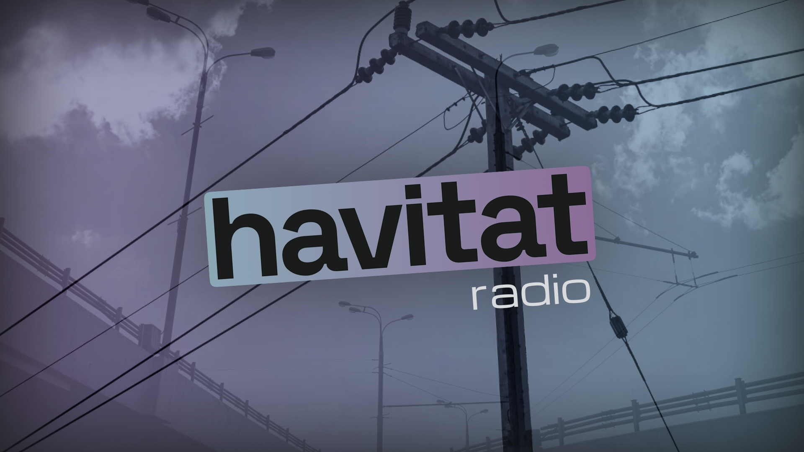
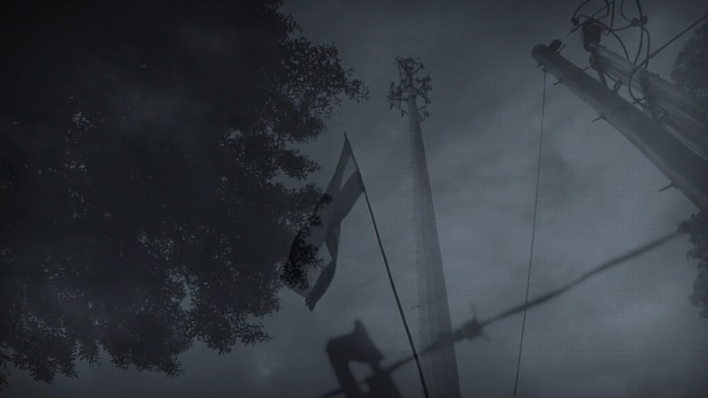
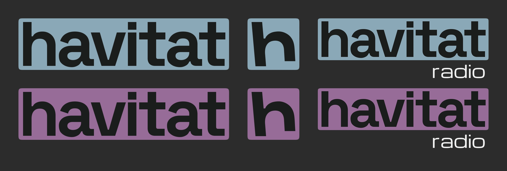
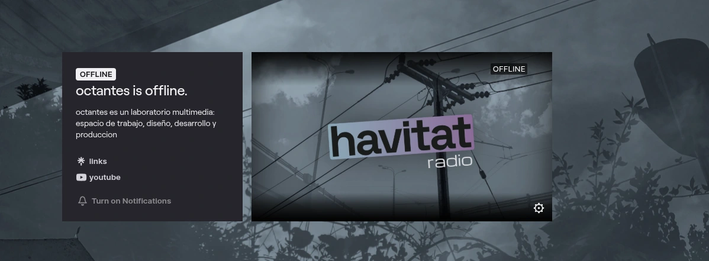

[!TEXT]

***havitat*** is my personal identity as a designer, serving a dual purpose: it represents my design practice while also framing a radio-like broadcast where I work and share music.

The main constraint was creating something neutral enough to frame very different design projects, while still being flexible and interesting enough to work across the stream.

### Inspirations

Restraint became the main solution. I looked to the lo-fi world of 2000s Adult Swim bumps for a way to keep things simple without feeling empty.

Timelapses of otherwise ignored places, white on black lowercase text, and casual wording created exactly the kind of distinct voice I was looking for.

### Connectivity

I wanted the radio show to carry that same feeling, staying chill and understated while still communicating something. The concept centers on connection, since it sits at the heart of what being online and broadcasting are about.

That led me to infrastructure as the main subject: cables, poles, antennas, roads and bridges. These are ordinary parts of the world that are easy to overlook, but also physical examples of connection.

### Filtering

Connectivity gave me the raw material for the identity. I used a set of blending filters and textures as a restrained way to post-process different assets. Together, they give the work a shared look.

A dedicated workflow lets me apply those filters to new assets, so I can quickly create images and videos in the same tone as needed.

### Voice

Lowercase is part of how *havitat* communicates. It makes the identity feel familiar and direct, closer to a message or a note than formal brand communication.

That tone keeps the design practice personal and the stream relaxed. It feels like an invitation to spend time in a shared space, rather than a broadcast coming from one central host.

### Stream

The stream works more like a small internet radio station than a conventional livestream. Music gives people something to share as they work on their own things, keeping each other company.

