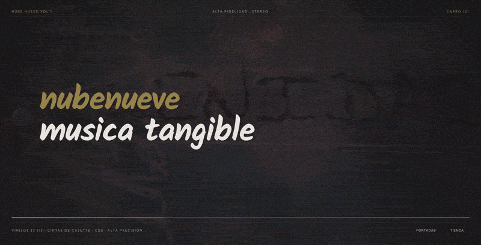
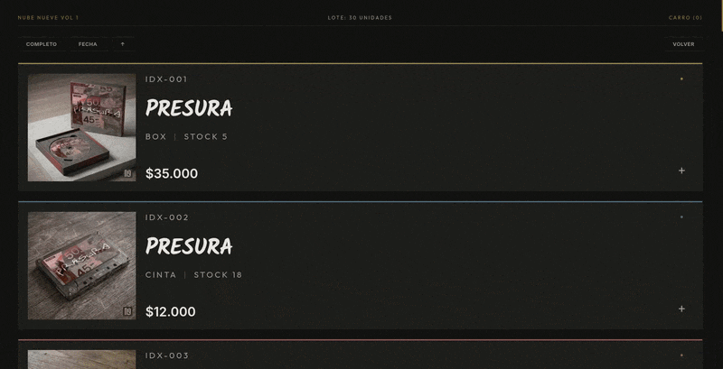
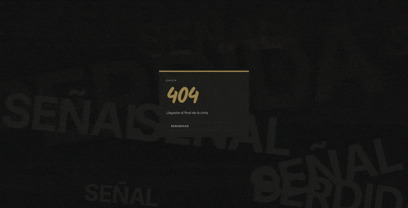

[!TEXT]

***

*Podés visitar la página [acá!](https://inercia-ar.github.io/front-nubenueve/)*

***

***nubenueve*** es un sello discográfico de nicho y una tienda digital construida alrededor de la experiencia física de la música: vinilo, cassette, CDs y las portadas que hacen a cada lanzamiento coleccionable y memorable.

Como el catálogo ya aporta el carácter, la identidad de marca y el sitio necesitaban un lenguaje visual contenido que introdujera calidez e hiciera que navegar se sintiera como hojear una colección de discos.

### Portadas

Las portadas de los álbumes tenían que funcionar como releases individuales, cada una expresando el concepto del artista y sintiéndose parte de un mismo catálogo. Todas exploran direcciones visuales distintas, pero las referencias internas de cada artista mantienen la colección conectada.

### Página

El sitio da al catálogo espacio para ser descubierto a través de las portadas, con formatos físicos e información apareciendo de a poco para dar tiempo a cada pieza.

La homepage tiene un sistema de presentación que anima con el arte de cada release, construido para crecer automáticamente conforme se suman más artistas y discos.