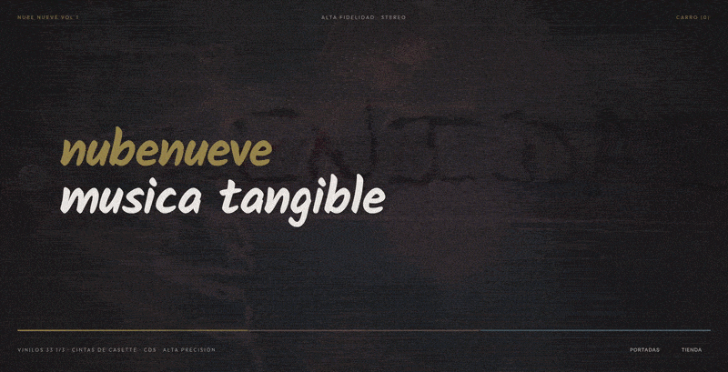
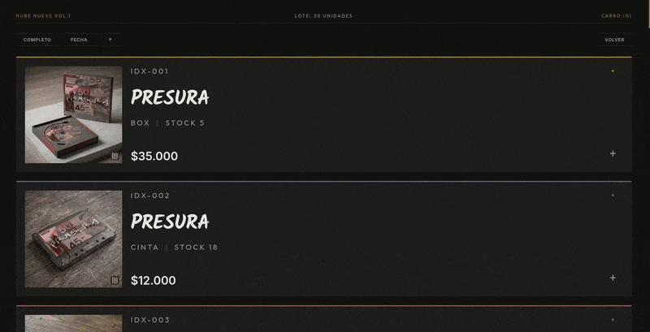
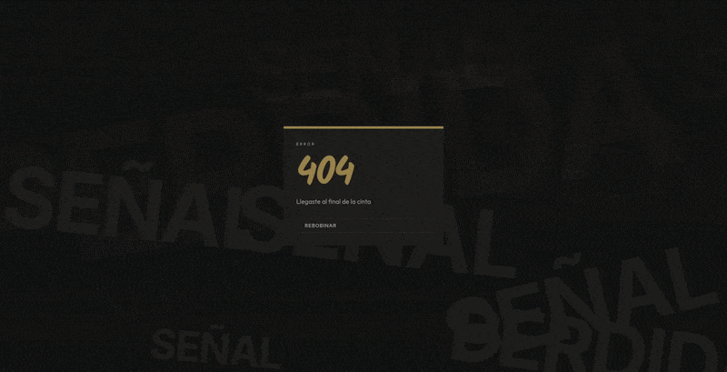

[!TEXT]

*You can visit the page [here!](https://inercia-ar.github.io/front-nubenueve/)*

nubenueve was my first *functional* design project for my portfolio
after so many fake brands, I wanted something real, in production and alive

the idea was to build a virtual record store with its *own* identity
I created four fictional artists, designing records with covers for each one

I explored animated backgrounds, textures and transitions in the interface
the system includes a **cart** page and an interactive cover art visualizer
the frontend works on its own but is prepared to be coupled to a backend
the design uses a warm palette, inspired by the aesthetic of tdk cassettes

project built with vue, vanilla css and figma for ui design
inspired by dano's great album, [el hombre hace planes, dios se rie](https://www.youtube.com/watch?v=s7aTWLNHCzw)