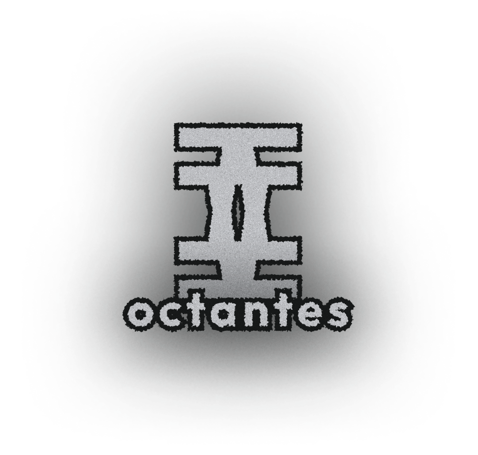
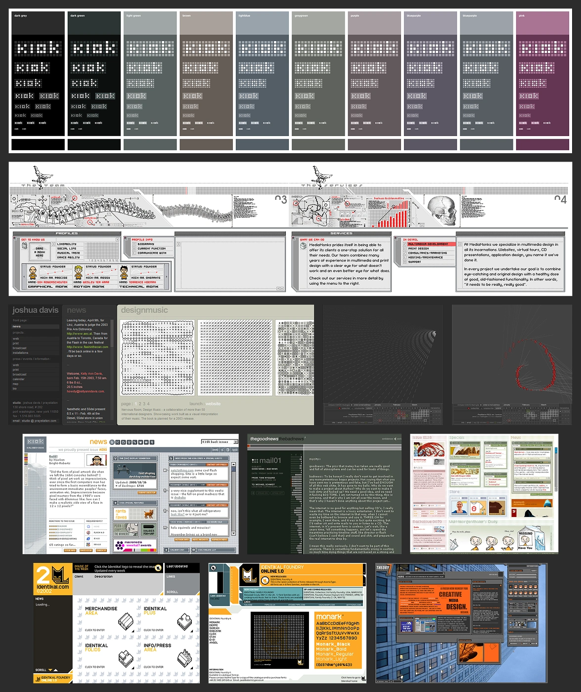
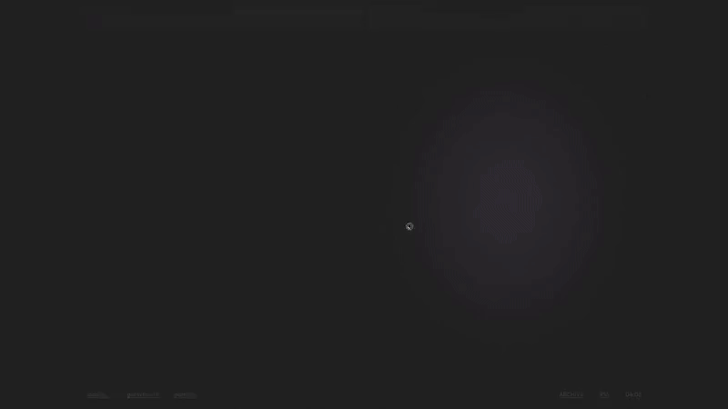
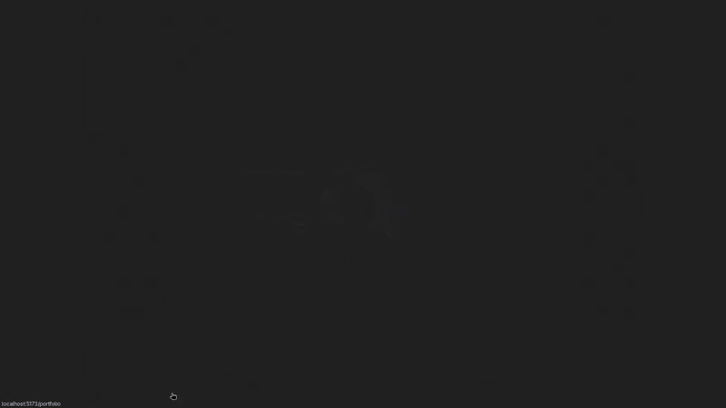
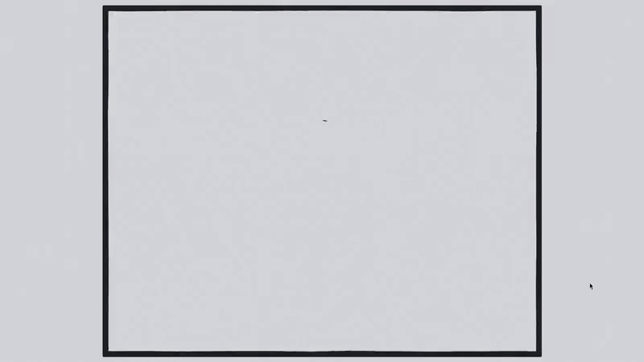
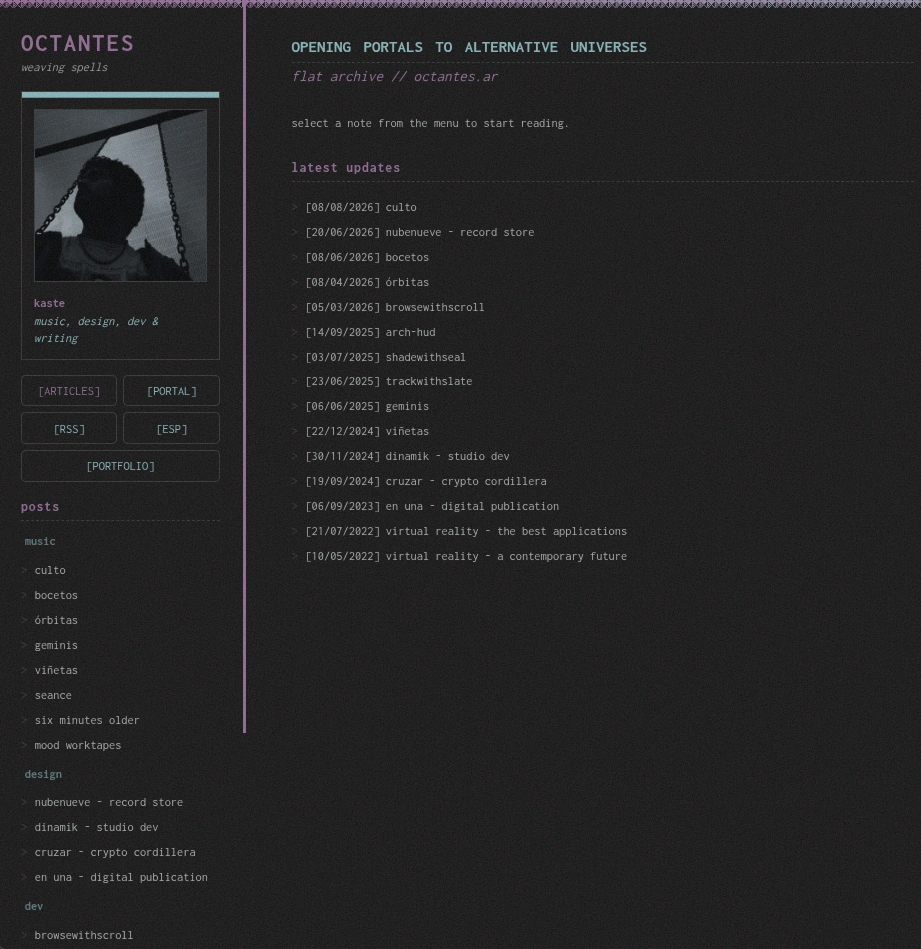

[!TEXT]

***octantes*** is my personal website, bringing together design, development, writing, music, games, and ongoing experiments. I wanted the site itself to become a reason to keep making things, with systems that could grow around the work.

The challenge was building a platform broad enough to hold different formats without flattening them or making navigation a mess. It needed to stay open to new ideas as it became my main creative focus.

### Inspirations

I've always been drawn to the early web, especially Flash sites and GeoCities. Kaliber10k was a major influence: each update was treated like a zine, with the whole page rebuilt around it. I wanted *octantes* to have some of that freedom.

I kept coming back to one question: what would that spirit look like with modern web architecture and UX? I chose SPAs for their frictionless navigation, but content loading can look abrupt. I needed a way to make those transitions feel authored.

### Portal

The portal shader is the answer to that problem. It is a hand-built animation system driven by a state machine, with specific animations for revealing content, direct loads, and transitions between sections.

It gives weight to the act of loading, turning a standard UI cut into a deliberate mechanism. To make the interface feel like a physical engine, navigation locks while the brief animations run, like in Hearthstone's UI.

Alongside the shader sits a gallery of cards housing the actual posts. Selecting a card triggers a transition and swaps the content underneath the portal. The end result is that you never actually see the content change.

### Portfolio

I also needed a streamlined entry point for my professional design and development work. Projects are arranged in a radial interface, where visitors spin through options and preview details before opening a case study in the main portal.

The layout uses a custom system of calculated slots, shifts, and angles that grows with the content without requiring changes to the code. This keeps the positioning precise while staying cheap to render.

### havitat and vitacora

*havitat* is a series of hand-drawn rooms offering an alternative, spatial way to navigate the site. Each room contains fully functional interfaces in the same style, rendered in real time as you explore.

The system implements a custom brush definition with a Flash-style line boil, keeping everything lightweight by using SVG instead of canvas or WebGL.

The same artisanal language extends to *vitacora*, an ongoing visual log for study sessions and smaller updates that don't fit as standalone posts. Entries append to a single continuous feed and animate as you scroll, letting the log grow over time.

### Archive

Whenever new content is deployed, the site automatically generates an archival version of itself. Every page remains reachable through an early-web, GeoCities-style HTML directory, which is served automatically to visitors without JS.

By stripping away the portal, shaders, and interactive layers, the archive keeps the work accessible across different hardware, browsers, and eras.