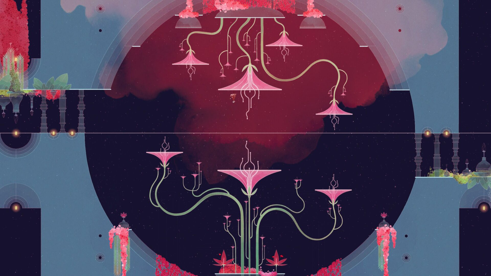

*Esta nota fue originalmente escrita para y publicada en [Press Over](https://pressover.news/opinion/kena-esta-bien-que-la-estetica-lo-sea-todo/)*

El 21 de septiembre salió Kena: Bridge of Spirits, el primer juego de Ember Lab, un equipo de desarrollo que comenzó su trayecto en el mundo de la animación y la creación de contenido digital. Desde su anuncio en 2020, el título generó mucha expectativa por su apartado visual, que mezcla un diseño 3D digno de Pixar con un mundo que recuerda a las mejores películas de Studio Ghibli.

Aunque fue bien recibido por la prensa, no se tardó en señalar una falta de profundidad e innovación mecánica, especialmente en el combate y el plataformeo. Esto recuerda a casos similares, como el de Gris, un indie con una estética impecable, pero criticado principalmente por no hacer nada novedoso en el género.

###¿Qué esperamos de los nuevos lanzamientos?
En una cultura gobernada por el hype, la primera impresión es fundamental para asegurar la venta, por eso se hace cada vez más énfasis en los trailers cinemáticos, dejando la jugabilidad en segundo plano. Frente a esta tendencia, que apunta a una audiencia más casual y mayoritaria, nuestra respuesta suele ser negativa.

Queremos ver gameplay, sistemas en funcionamiento y que no nos escondan el HUD. En definitiva, queremos presentaciones en las que entendamos realmente cómo va a ser la experiencia que vamos a vivir. Son expectativas lógicas, especialmente de parte de un público que tiene que decidir en qué fichín se va a gastar esos 60 dólares, pero contrastan con un modelo de industria en el que los primeros avances se muestran en la etapa de preproducción, usualmente sin tener ni siquiera un prototipo funcional.

Al momento de sentarnos a probar un nuevo título, queremos que nos sorprenda, y lo analizamos en base a experiencias previas. Si bien no hay ningún problema intrínseco en esta mirada, pienso que a veces puede opacar el aspecto artístico. Podemos, y probablemente debemos, criticar la falta de innovación, pero nunca dejemos de lado lo que nos hace sentir, su estética, su forma de narrar. 

###¿Cómo reaccionamos?
No nos vendría mal ser un poco más pacientes y permitir el desarrollo de obras dentro del marco de sistemas actual, después de todo, el medio aún es joven y está creciendo a pasos de gigante, no es necesario que lo apuremos. Aunque se usen mecánicas ya vistas, tratemos de valorar su recontextualización, explorándolas en distintos universos y con distintas motivaciones, a su vez solidificando las herramientas interactivas del formato y haciéndolas más accesibles. No propongo que critiquemos a las creaciones aisladas de su entorno, sino que le demos más importancia al sentido de la jugabilidad dentro del mundo planteado.

También recordemos que los visuales, la música, los sonidos y el guion pueden aportar muchísimo al avance y la consolidación de un género, atrayendo a una nueva audiencia y acostumbrándola a sus estándares. Retomando el ejemplo de Gris, podemos evidenciar en las reseñas de Steam que una gran parte de su público no sabía qué esperar al comprarlo. Tanto las opiniones positivas como las negativas destacan que lo que captó su interés fue el apartado artístico, resaltando entre otros plataformas y funcionando como puerta de entrada.

Esta discusión está muy relacionada con el ya clásico debate de “gráficos versus contenido”, que creo que hemos podido superar. Así como muchos defendimos a capa y espada la importancia de la profundidad narrativa frente a la evolución gráfica, para luego entender que ambas tienen un espacio en la industria, ojalá con el tiempo logremos comprender que existe la necesidad de juegos sin la ambición de revolucionar todo. En un medio que esta llegando a la madurez, a veces tenemos que apurar el paso y madurar con él.