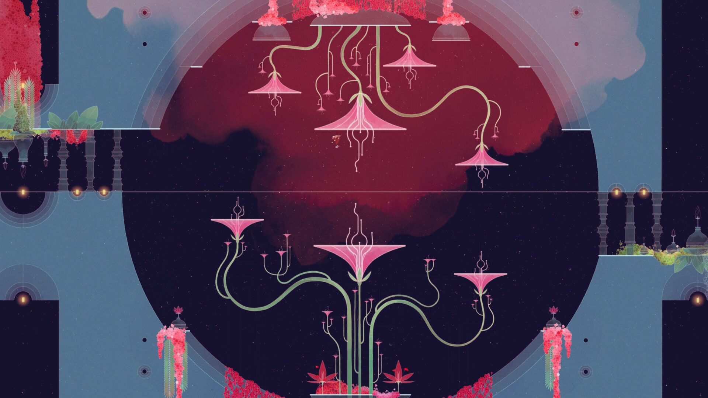
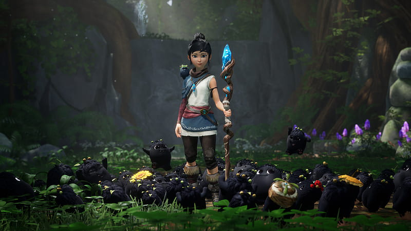
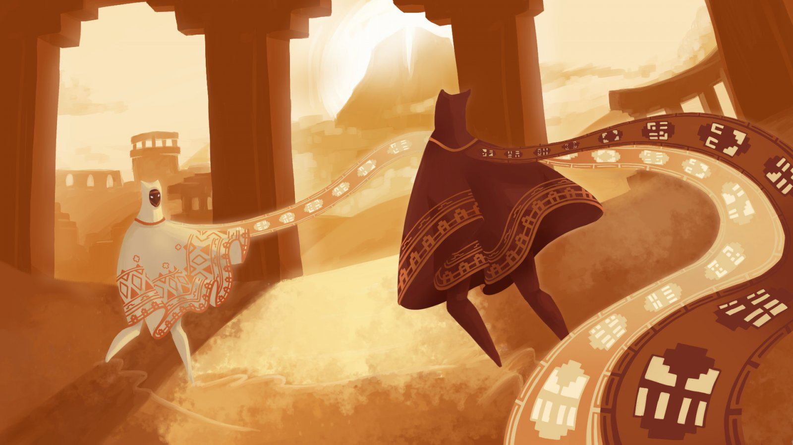

*This note was originally written for and published in [Press Over](https://pressover.news/opinion/kena-esta-bien-que-la-estetica-lo-sea-todo/)*

On September 21, Kena: Bridge of Spirits was released, the first game by Ember Lab, a development team that began its journey in the world of animation and digital content creation. Since its announcement in 2020, the title generated **a lot of expectation for its visual style**, blending Pixar-worthy 3D design with a world reminiscent of the best Studio Ghibli films.

Although well received by the press, it didn't take long to point out a *lack of depth and mechanical innovation*, especially in combat and platforming. This recalls similar cases, like Gris, an indie with impeccable aesthetics, but criticized mainly for not doing anything novel in the genre.

### What do we expect from new releases?
In a culture governed by hype, *first impressions are essential to secure the sale*, which is why more and more emphasis is placed on cinematic trailers, leaving gameplay in the background. Faced with this trend, which targets a more casual and mainstream audience, our response is usually negative.

We want to see gameplay, working systems, and not have the HUD hidden from us. In short, **we want presentations where we truly understand what the experience we're about to have will be like**. These are logical expectations, especially from an audience that has to decide which title to spend those 60 dollars on, but they contrast with an industry model where early previews are shown in the pre-production stage, usually without even having a functional prototype.

When we sit down to try a new title, we want to be surprised, and we analyze it based on previous experiences. While there's nothing intrinsically wrong with this perspective, I think *it can sometimes overshadow the artistic aspect*. We can, and probably should, criticize the lack of innovation, but let's never set aside what it makes us feel, its aesthetics, its way of storytelling.

### How do we react?
It wouldn't hurt us to be a little more patient and allow works to develop within the framework of current systems. After all, *the medium is still young and growing by leaps and bounds, there's no need to rush it*. Even if mechanics already seen are used, let's try to value their recontextualization, exploring them in different universes and with different motivations, while solidifying the interactive tools of the format and making them more accessible. I'm not proposing we critique creations in isolation from their environment, but rather give more importance to the meaning of gameplay within the world presented.

Let's also remember that visuals, music, sounds, and script can contribute enormously to the advancement and consolidation of a genre, attracting new audiences and familiarizing them with its standards. Returning to the Gris example, we can see in Steam reviews that **a large part of its audience didn't know what to expect when buying it**. Both positive and negative reviews highlight that what captured their interest was the artistic aspect, standing out among other platformers and functioning as a gateway.

This discussion is closely related to the *already classic debate of "graphics versus content"*, which I think we've been able to move past. Just as many of us defended tooth and nail the importance of narrative depth against graphical evolution, only to later understand that both have a place in the industry, hopefully in time we'll come to understand that there is a need for games without the ambition to revolutionize everything. In a medium that is reaching maturity, **sometimes we need to pick up the pace and mature with it**.
