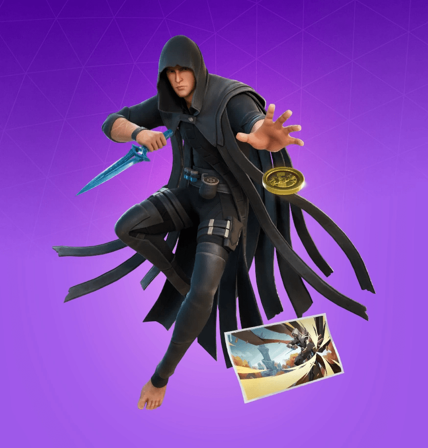
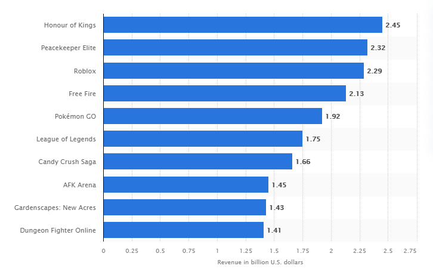
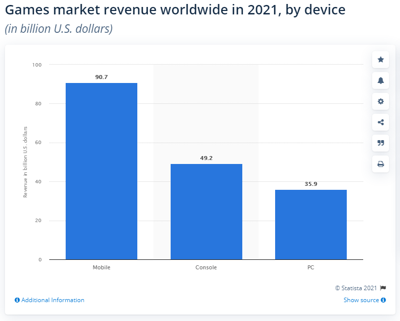
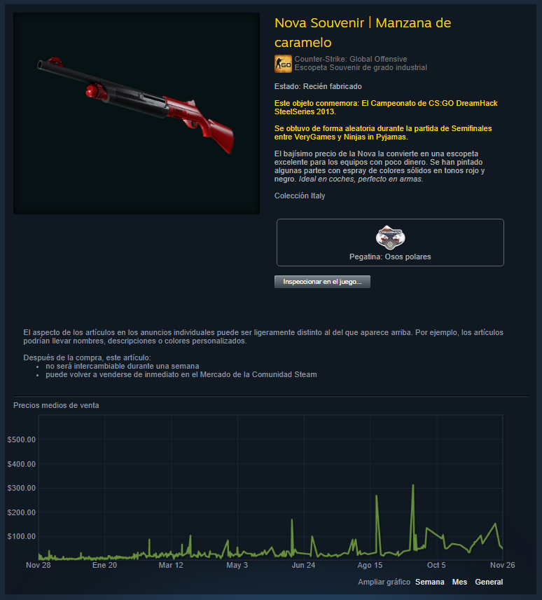

*Esta nota fue originalmente escrita para y publicada en [Press Over](https://pressover.news/articulos/las-microtransacciones-y-su-futuro/)*

Muchos las evitamos a toda costa, otros las consideran una parte fundamental de su experiencia al jugar. Si bien el debate sobre las microtransacciones está *plagado de polémicas*, la realidad es que pertenecen a la mayoría de los mundos que habitamos cotidianamente, y como tal, es importante pensarlas de cara al futuro. Para esto, primero debemos definirlas.

Básicamente, las microtransacciones consisten en la **compra de bienes digitales por medio de pagos online**. La oferta es muy amplia y depende del juego, pero podemos separarlos en dos categorías según su función: cosméticos y funcionales.

### Bienes cosméticos

Dentro de esta categoría se encuentran los elementos que no afectan de manera significativa a la jugabilidad. En la mayoría de los casos, su objetivo es *cambiar la estética*, ya sea por medio de skins para los personajes o armas, bailes, interacciones, o alteraciones visuales en el mapa.

La motivación para adquirir este tipo de efectos varía mucho, pero se suele centrar en *el apego emocional del jugador con los personajes y el mundo que plantea cada obra*. Aunque están mejor vistos que los funcionales, monetizar un aspecto tan cercano a los sentimientos da lugar en muchos casos al abuso del marketing y la psicología para incentivar a los usuarios a comprar cosas que no quieren.

### Bienes funcionales

En este apartado conviven los aumentos de experiencia, los personajes o armas que sólo se pueden conseguir pagando, los mapas exclusivos, vidas extra y cualquier tipo de objeto que le dé una ventaja dentro del sistema a los compradores.

Los bienes funcionales suelen ser criticados por la **falta de equidad que generan en la comunidad**, especialmente cuando los beneficios afectan directamente a los enfrentamientos entre jugadores, disminuyendo el valor de la experiencia, el entrenamiento y el conocimiento. La creación de términos como “pay to win” (pagar para ganar) reflejan el desprecio que sienten muchos por la implementación de estas prácticas.

Otros objetos quedan fuera de estas categorías, como las lootboxes, que ofrecen recompensas aleatorias al abrirlas, o los pases de temporada, que permiten desbloquearlas al subir de nivel.

### ¿Por qué existen las microtransacciones?

Detrás de cada título que consumimos, hay un equipo que dedicó su tiempo e inevitablemente, sus recursos económicos para desarrollarlo. Puede sonar obvio, pero hay una tendencia a olvidar que la razón por la cual podemos disfrutar de un medio tan diverso es porque hay un modelo de negocio que **crea puestos de trabajo y motiva inversiones** respondiendo a las demandas de los compradores.

Con tanta pasión de por medio, esta es una forma un poco frívola de entender a la industria, pero al final del día, esos equipos tienen que comer. Dejemos en claro que, a pesar de la necesidad de un sistema económico, nunca debemos dejar de criticar su funcionamiento. *La cantidad de fallos, abusos y potenciales amenazas tanto para los desarrolladores como para los consumidores son inexcusables*, y la única forma de combatirlos es conversando, debatiendo, y formando nuestra postura.

### El rol de las microtransacciones dentro del mercado

Dentro del modelo de negocio establecido, las microtransacciones son la columna vertebral sobre la cual subsiste un gran porcentaje de la industria, especialmente cuando hablamos de títulos gratuitos y juegos como servicio. Actualmente, muchas empresas eligen el *formato freemium* para llegar a más gente y generar más ingresos a largo plazo. En otros casos, se aplica la misma idea a productos pagos, aprovechando una base de jugadores sólida que está dispuesta tanto a comprar el fichín como a pagar por elementos exclusivos.

Recientemente se inició un proceso de regulación legislativa para proteger a los consumidores, disparando estudios que cuestionan la ética de estas prácticas, especialmente cuando el público objetivo es menor de edad. Los resultados demuestran que el uso de **efectos visuales, animaciones y sonidos activan una respuesta a nivel químico en el cerebro muy similar a la de las apuestas**, lo cual las hace adictivas. Varios países ya han regulado o eliminado completamente las microtransacciones, pero aún no existen normativas que lo hagan a nivel mundial.

### El Mercado del Futuro

Ahora que entendemos las bases, podemos pasar a algo un poco más complejo: preguntarnos hacia dónde se dirige este modelo. Si bien no pretendo hacer futurología, analizar algunos sistemas que vienen creciendo nos permite plantear varias posibilidades.

Una de las últimas tendencias dentro de la monetización de videojuegos viene de la mano de la blockchain, una tecnología que, entre otras cosas, sirve para *descentralizar elementos digitales, haciéndolos únicos e irreproducibles*. Al ser lanzados al mercado, estos objetos virtuales llamados NFTs (tokens no fungibles) adquieren un valor propio que responde a variables culturales y temporales fuera del control de la empresa o persona responsable de su creación.

### ¿Cómo se aplican a las microtransacciones?

La explosión de los NFTs ha sido fuertemente criticada por su impacto en el medioambiente, pero algunos de los conceptos en los que se basan llevan varios años en el gaming. Por ejemplo, en el mercado de Counter Strike, cada skin es única. **Dos personas pueden comprar el mismo objeto, pero estos van a tener diferencias sutiles**, como marcas de desgaste en lugares aleatorios que pueden elevar o disminuir su valor. La razón por la cual no podemos considerarlos NFTs es porque no funcionan en una blockchain, sino en el mercado centralizado de steam.

La mayoría de los criptojuegos que exploran estas opciones las presentan como su principal novedad, pero es esperable que con el paso del tiempo y al ver los resultados de los experimentos actuales, *se vayan integrando a productos más diversos*.

Si algo aprendimos en estos años es que no falta ingenio para integrar cualquier sistema que genere números, como sucedió con los pases de batalla. Esperemos que, pase lo que pase, las condiciones mejoren para todos, y recordemos que, mientras más informados estemos, más difícil va a ser que nos engañen.