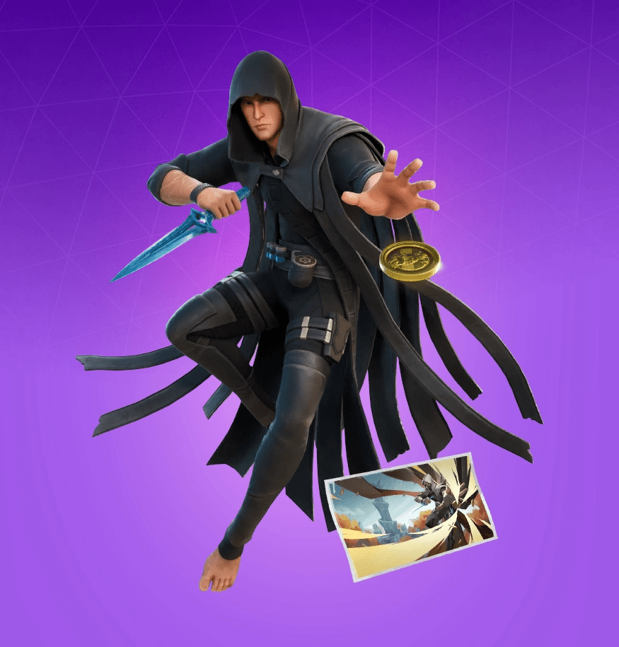
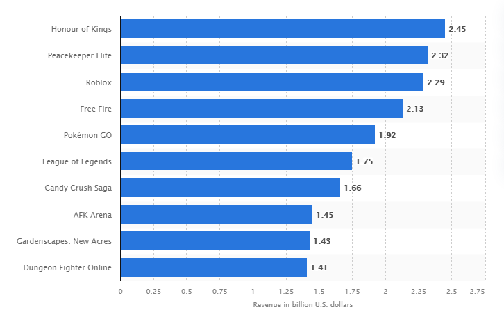
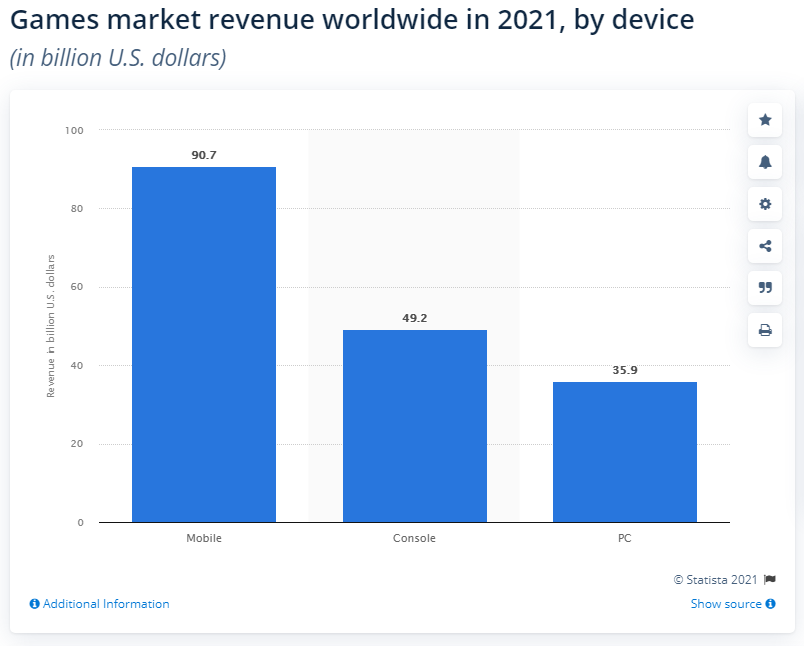
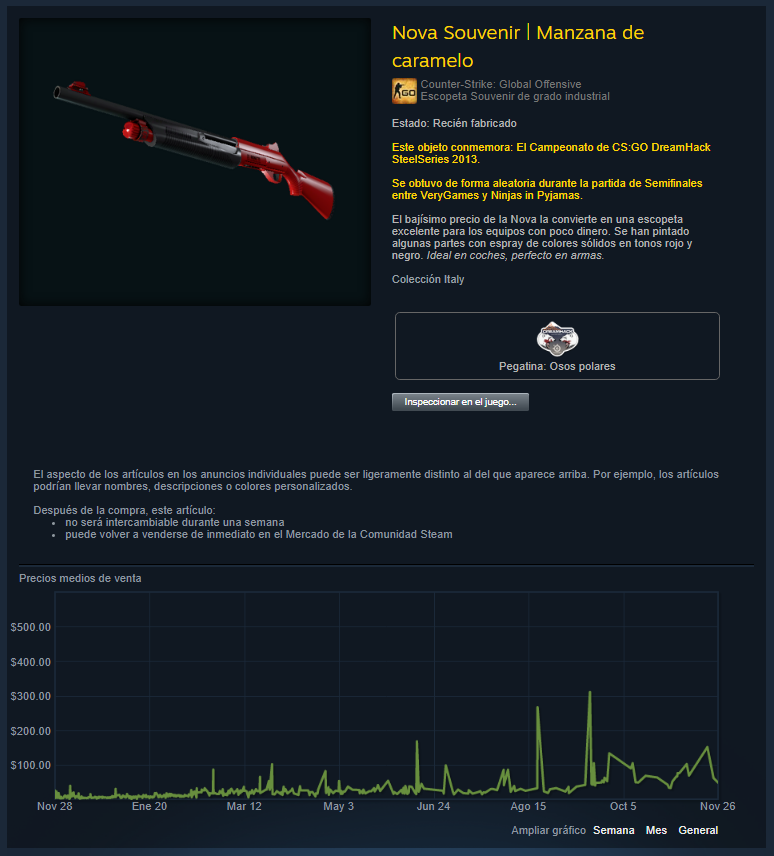

*This note was originally written for and published in [Press Over](https://pressover.news/articulos/las-microtransacciones-y-su-futuro/)*

Many of us avoid them at all costs, others consider them a fundamental part of their gaming experience. While the debate over microtransactions is *rife with controversy*, the reality is that they belong to most of the worlds we inhabit daily, and as such, it's important to think about them going forward. To do this, we must first define them.

Basically, microtransactions consist of the **purchase of digital goods through online payments**. The offering is very broad and depends on the game, but we can separate them into two categories based on their function: cosmetic and functional.

### Cosmetic Goods

Within this category are items that do not significantly affect gameplay. In most cases, their goal is to *change the aesthetics*, whether through skins for characters or weapons, dances, interactions, or visual alterations to the map.

The motivation to acquire this type of effect varies greatly, but usually centers on *the player's emotional attachment to the characters and world presented by each work*. Although they are better regarded than functional ones, monetizing an aspect so close to feelings often leads to abuse of marketing and psychology to incentivize users to buy things they don't want.

### Functional Goods

This category includes experience boosts, characters or weapons that can only be obtained by paying, exclusive maps, extra lives, and any type of item that gives buyers an advantage within the system.

Functional goods are often criticized for the **lack of fairness they generate in the community**, especially when the benefits directly affect player versus player encounters, diminishing the value of experience, training, and knowledge. The creation of terms like "pay to win" reflects the disdain many feel for the implementation of these practices.

Other items fall outside these categories, such as lootboxes, which offer random rewards when opened, or season passes, which allow unlocking them by leveling up.

### Why do microtransactions exist?

Behind every title we consume, there is a team that dedicated their time and inevitably their financial resources to develop it. It may sound obvious, but there is a tendency to forget that the reason we can enjoy such a diverse medium is because there is a business model that **creates jobs and motivates investments** responding to buyer demand.

With so much passion involved, this is a somewhat frivolous way to understand the industry, but at the end of the day, those teams have to eat. Let's be clear: despite the need for an economic system, we must never stop criticizing its operation. *The number of failures, abuses, and potential threats to both developers and consumers is inexcusable*, and the only way to combat them is by talking, debating, and forming our stance.

### The role of microtransactions in the market

Within the established business model, microtransactions are the backbone on which a large percentage of the industry subsists, especially when we talk about free-to-play titles and games as a service. Currently, many companies choose the *freemium format* to reach more people and generate more long-term revenue. In other cases, the same idea is applied to paid products, leveraging a solid player base that is willing to both buy the title and pay for exclusive items.

Recently, a process of legislative regulation has begun to protect consumers, triggering studies that question the ethics of these practices, especially when the target audience is minors. The results show that the use of **visual effects, animations, and sounds activate a chemical response in the brain very similar to gambling**, making them addictive. Several countries have already regulated or completely eliminated microtransactions, but there are still no global regulations.

### The Future Market

Now that we understand the basics, we can move on to something a bit more complex: asking where this model is headed. While I don't intend to do futurology, analyzing some growing systems allows us to consider several possibilities.

One of the latest trends in video game monetization comes from blockchain, a technology that, among other things, serves to *decentralize digital elements, making them unique and unreproducible*. When released to the market, these virtual objects called NFTs (non-fungible tokens) acquire their own value that responds to cultural and temporal variables outside the control of the company or person responsible for their creation.

### How do they apply to microtransactions?

The explosion of NFTs has been heavily criticized for its environmental impact, but some of the concepts they are based on have been in gaming for several years. For example, in the Counter Strike market, each skin is unique. **Two people can buy the same item, but they will have subtle differences**, such as wear marks in random places that can increase or decrease its value. The reason we can't consider them NFTs is because they don't operate on a blockchain, but on Steam's centralized market.

Most crypto games exploring these options present them as their main novelty, but it's expected that over time and seeing the results of current experiments, *they will be integrated into more diverse products*.

If we've learned anything in these years, it's that there's no shortage of ingenuity to integrate any system that generates numbers, as happened with battle passes. Let's hope that, whatever happens, conditions improve for everyone, and remember that the more informed we are, the harder it will be to deceive us.
