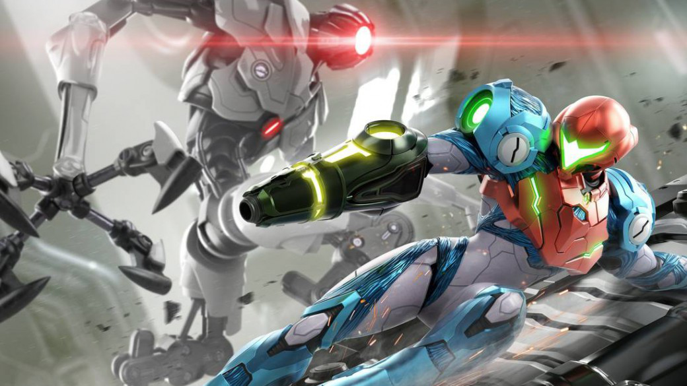
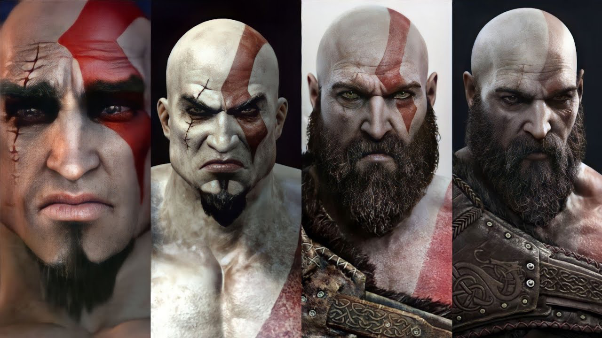
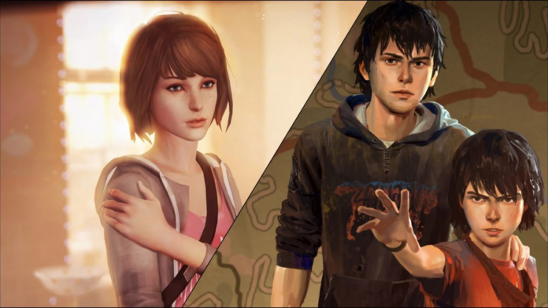
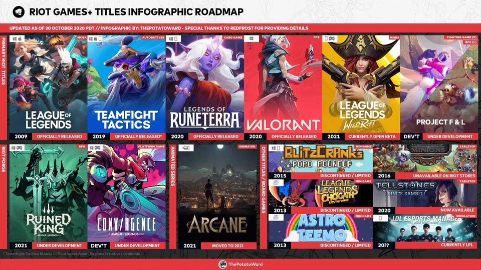
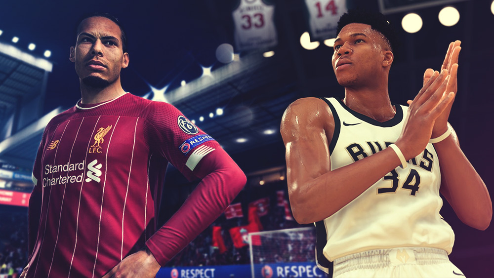

*Esta nota fue originalmente escrita para y publicada en [Press Over](https://pressover.news/opinion/no-solo-propiedades-intelectuales/)*

Con la consolidación del videojuego como una de las industrias más importantes de entretenimiento masivo, empezamos a notar una tendencia en muchos estudios a desarrollar propiedades intelectuales repetibles y atrapantes para sostenerse en el tiempo a través de varias entregas. Hoy en día, el interés en obras consecutivas tiene **menos que ver con las particularidades de los autores y más con su universo, la nostalgia y el hype**.

Hay tantas opiniones sobre esta situación como jugadores, por eso, el objetivo de esta nota es *destacar algunos puntos que no se suelen escuchar en el debate* y que tal vez ayuden a apartarnos un poco de la grieta. Para esto, debemos tener en claro algunos términos fundamentales.

### Propiedades Intelectuales y Franquicias

IP, o propiedad intelectual, es la expresión que engloba al conjunto de elementos protegidos legalmente que componen una creación física o intangible. Para proteger las distintas partes se usan una serie de herramientas, como las patentes, el copyright y las marcas registradas, entre otras, que le permiten al autor explotar económicamente su obra, **dándole la posibilidad de detener a quien lo haga sin su permiso**.

Muchas veces encontramos la expresión utilizada como sinónimo de franquicia, pero hay que hacer una distinción: franquiciar suele implicar una concesión de derechos, en la que el dueño le permite al franquiciado hacer uso de su IP. En nuestro tópico, la diferencia no está tan clara, habiendo varias definiciones posibles. Para el propósito de la nota, vamos a tomar la palabra como *“los distintos productos multimediales que derivan de un original, sin importar el creador”*.

Si analizamos los principales lanzamientos con estas características, vamos a encontrar maneras muy diversas de encarar el formato. Definamos las cuatro principales:

### Sagas Continuistas

Hay juegos que plantean su historia en arcos narrativos. Si bien cada uno suele completar una estructura contenida, las secuelas permiten seguir explorando la progresión de sus personajes en otras situaciones, completando una aventura mucho más larga. Bien utilizada, **esta continuidad les permite a los guionistas profundizar en los vínculos que construye el protagonista** y proponer momentos de respiro al no tener la presión constante de cerrar la trama.

Algunos ejemplos de sagas continuistas recientes son Last Of Us y God Of War.

### Sagas Generacionales

La posibilidad de crear un universo de cero es muy interesante. Los desarrolladores tienen un lienzo en blanco limitado únicamente por el tiempo y el presupuesto. Crear una franquicia no tiene por qué ser distinto si se evita el uso de elementos previamente establecidos. En las sagas generacionales, **cada fichín cuenta una historia auto conclusiva**, conservando algunas similitudes con sus antecesores.

Life Is Strange encontró una forma de narrar propia y un estilo artístico atractivo que mantiene en todos sus títulos, pero cuando un ciclo termina, descartan a sus personajes y buscan un nuevo entorno. Habiendo logrado en el primero unos protagonistas muy queridos, *abandonarlos es una decisión riesgosa* pero sana.

### Propiedades Intelectuales Modulares

Cuando la jugabilidad sienta las bases de una propiedad, y el resto toma un segundo plano, dejamos de hablar de sagas y volvemos a hablar de IPs. En busca de expandir el alcance, *se crean derivados con distintos objetivos, algunas para alimentar el trasfondo, y otras para seguir ramificando las ofertas*.

League Of Legends, de Riot Games, está compuesto por unas cuantas franquicias. La principal, obviamente, es el MOBA, pero también están Legends Of Runeterra, Teamfight Tactics y Wild Rift, para establecerse en otros géneros y plataformas. Arcane, Ruined King y Song Of Nunu forman parte de las experiencias narrativas, y Tellstones nos permite traer a la vida real una parte del mundo de Runaterra.

### Propiedades Intelectuales Iterativas

Por último, existe una categoría que consiste en **refinar entrega a entrega un mismo concepto**, cambiando pequeñas mecánicas, actualizando el apartado visual y agregando nuevos arquetipos.

Estamos acostumbrados a que la mayoría de los juegos de deportes sean iterativos, con secuelas anuales. Muchos de estos productos cambian lo mínimo posible para justificar el lanzamiento, dejando obsoletos a los anteriores para obligar a la audiencia a pasar por caja nuevamente. Otros géneros, como los Fighting Games, se toman más tiempo para escuchar a la comunidad y evolucionar la propuesta.

### ¿Qué esperamos?

Cada vez que se acerca un nuevo evento, empezamos a leer las expectativas de muchísimas personas. Generalmente, la mayoría nombran posibles secuelas de grandes éxitos, o reboots de series importantes. La otra parte va a pedir a gritos algo nuevo, y aunque si tomamos la presentación del E3 de Microsoft vamos a ver que de 38 fichines que aparecieron, 15 son nuevas propiedades, éstas no suelen satisfacer esa demanda.

Por eso, *creo que el problema no es que hagan falta nuevas IPs, sino nuevos formatos*. Pienso que hay una gran desconexión entre la industria y la comunidad debido a una falla en nuestra comunicación. Ya tenemos sagas continuistas, generacionales, modulares e iterativas. No importa si continuamos la expansión de un mundo o arrancamos de cero, es tiempo de salirnos del marco.

Como conclusión, recordemos que **la reutilización es uno de los pilares sobre los que se construyó el videojuego**. Sin reciclar código, motores, assets e incluso personajes, hoy no tendríamos un lenguaje que nos diferencie. La búsqueda de innovar conlleva sus riesgos, por eso apoyemos a quienes crean por fuera de lo esperable, y esperemos que de a poco, más y más estudios puedan darse cuenta de lo que queremos.