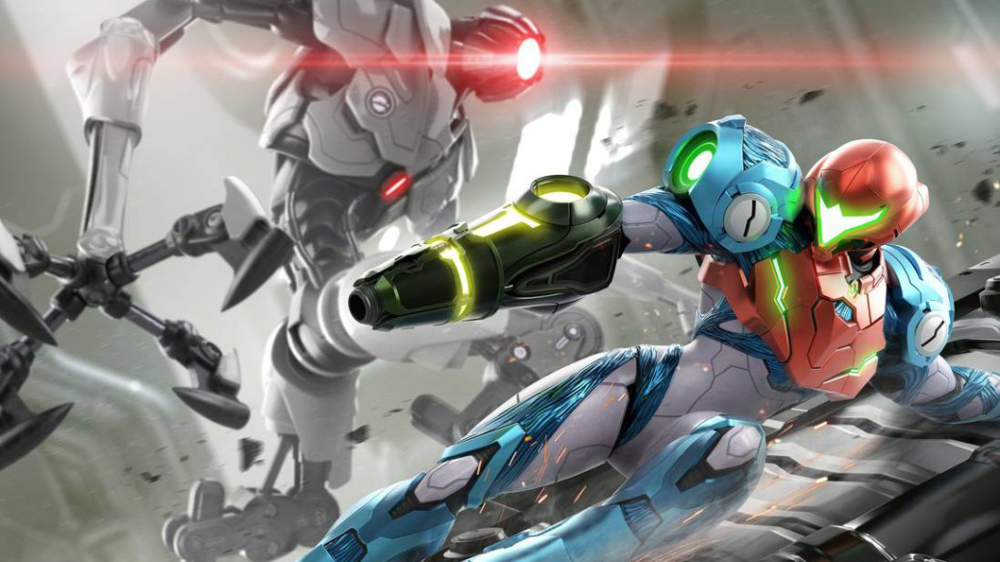
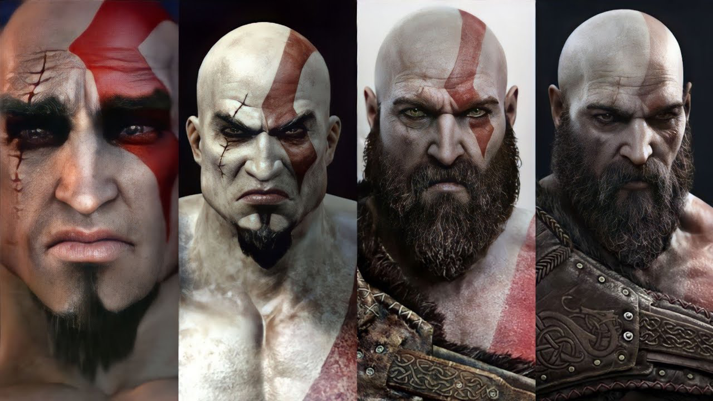
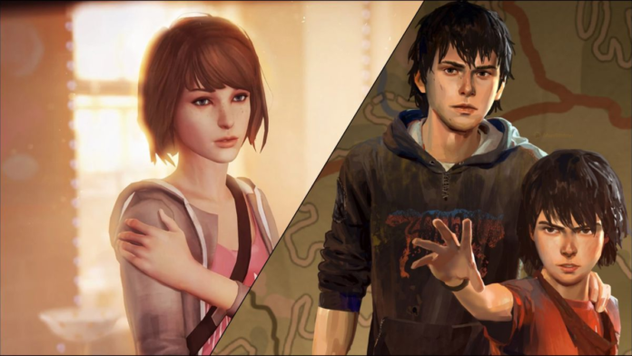
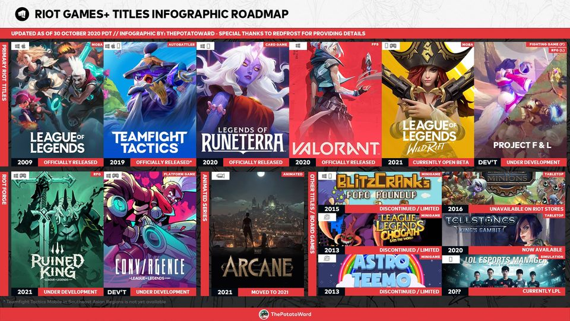
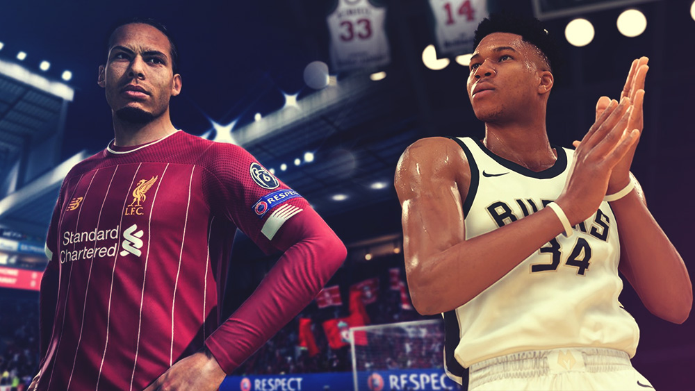

*This note was originally written for and published in [Press Over](https://pressover.news/opinion/no-solo-propiedades-intelectuales/)*

With the consolidation of video games as one of the most important mass entertainment industries, we began to notice a trend in many studios to develop repeatable and engaging intellectual properties to sustain themselves over time through multiple installments. Nowadays, interest in consecutive works has **less to do with the particularities of the authors and more with their universe, nostalgia, and hype**.

There are as many opinions on this situation as there are players, so the goal of this note is to *highlight some points not often heard in the debate* that might help us step away from the binary divide. To do this, we need to be clear about some fundamental terms.

### Intellectual Properties and Franchises

IP, or intellectual property, is the expression that encompasses the set of legally protected elements that make up a physical or intangible creation. To protect the different parts, a series of tools are used, such as patents, copyright, and trademarks, among others, which allow the author to economically exploit their work, **giving them the ability to stop anyone who does so without their permission**.

We often find the expression used as a synonym for franchise, but a distinction must be made: franchising usually implies a concession of rights, in which the owner allows the franchisee to use their IP. In our topic, the difference is not so clear, with several possible definitions. For the purpose of this note, we will take the word as *"the various multimedia products derived from an original, regardless of the creator"*.

If we analyze the major releases with these characteristics, we will find very diverse ways of approaching the format. Let's define the four main ones:

### Continuist Sagas

There are games that tell their story in narrative arcs. While each usually completes a contained structure, sequels allow us to continue exploring the progression of their characters in other situations, completing a much longer adventure. Well used, **this continuity allows writers to deepen the bonds the protagonist builds** and propose moments of respite without the constant pressure of closing the plot.

Some examples of recent continuist sagas are Last Of Us and God Of War.

### Generational Sagas

The possibility of creating a universe from scratch is very interesting. Developers have a blank canvas limited only by time and budget. Creating a franchise doesn't have to be different if the use of previously established elements is avoided. In generational sagas, **each title tells a self-contained story**, retaining some similarities with its predecessors.

Life Is Strange found its own narrative style and an attractive artistic aesthetic that it maintains across all its titles, but when a cycle ends, they discard their characters and look for a new setting. Having achieved very beloved protagonists in the first game, *abandoning them is a risky but healthy decision*.

### Modular Intellectual Properties

When gameplay lays the foundation of a property, and everything else takes a back seat, we stop talking about sagas and go back to talking about IPs. In search of expanding reach, *derivatives are created with different objectives, some to feed the lore, and others to further branch the offerings*.

League Of Legends, by Riot Games, is composed of several franchises. The main one, obviously, is the MOBA, but there's also Legends Of Runeterra, Teamfight Tactics, and Wild Rift, to establish themselves in other genres and platforms. Arcane, Ruined King, and Song Of Nunu are part of the narrative experiences, and Tellstones allows us to bring a part of the Runeterra world into real life.

### Iterative Intellectual Properties

Finally, there is a category that consists of **refining the same concept from release to release**, changing small mechanics, updating the visuals, and adding new archetypes.

We're used to most sports games being iterative, with annual sequels. Many of these products change as little as possible to justify the release, making previous versions obsolete to force the audience to pay again. Other genres, like Fighting Games, take more time to listen to the community and evolve the proposal.

### What do we expect?

Every time a new event approaches, we start reading the expectations of many people. Generally, most name possible sequels of big hits, or reboots of important series. The other part will loudly ask for something new, and although if we look at Microsoft's E3 presentation we'll see that out of 38 titles that appeared, 15 are new properties, these don't usually satisfy that demand.

Therefore, *I think the problem is not that we need new IPs, but new formats*. I believe there is a great disconnect between the industry and the community due to a failure in our communication. We already have continuist, generational, modular, and iterative sagas. It doesn't matter if we continue expanding a world or start from scratch, it's time to step outside the framework.

In conclusion, let's remember that **reuse is one of the pillars on which video games were built**. Without recycling code, engines, assets, and even characters, we wouldn't have a language that differentiates us today. The search for innovation carries its risks, so let's support those who create outside the expected, and hopefully, little by little, more and more studios will realize what we want.
