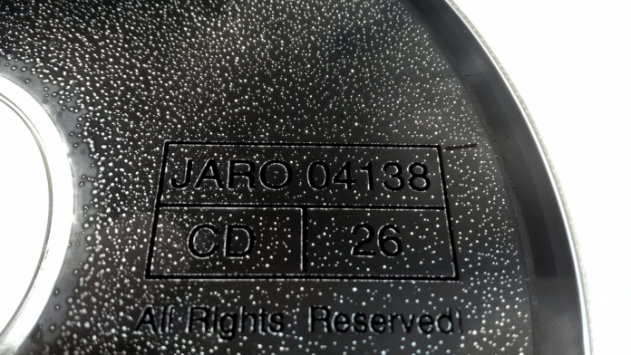

*Esta nota fue originalmente escrita para y publicada en [Press Over](https://pressover.news/opinion/abandonware-la-permanencia-del-autor/)*

A medida que las artes maduran, surgen problemas que complejizan la conservación de ciertas obras. Todas las disciplinas sufren en mayor o menor medida el paso del tiempo, pero cuando el arte está estrechamente ligado al continuo avance de la tecnología, como en nuestra industria, esas dificultades se intensifican. Existen especialistas en la restauración de pinturas. El cine ha encontrado las mejores formas de almacenar celuloides y vemos edificios en reparación constantemente, pero mientras tanto, muchos juegos están desapareciendo. Hablemos del abandonware.

### ¿Abandonware? ¿Qué es?
Cuando hablamos de abandonware, solemos pensar en consolas antiguas y monitores de tubo, pero en realidad, el término hace referencia al **abandono de cualquier tipo de software por parte de sus desarrolladores o proveedores**. Al ocurrir, los usuarios pueden perder el soporte técnico, la posibilidad de comprar, descargar o incluso utilizar el producto y a veces, la compatibilidad con nuevos sistemas operativos o hardware.

### ¿Por qué sucede?
Si bien esta etapa suele darse junto con el fin del ciclo de vida del programa, también puede desencadenarse a partir del quiebre de una empresa, o su salida del mercado, en cuyo caso la propiedad intelectual puede quedar en un limbo legal del cual es muy difícil rescatarlos, usualmente debido a la falta de documentos legales o la muerte de alguno de los titulares.

Otra posibilidad es que la compañía o el producto sean comprados, en cuyo caso los nuevos propietarios pueden eliminar la disponibilidad del software, e incluso perseguir legalmente los intentos de uso y distribución por parte de los usuarios.

### ¿Es importante conservar?
Todas las aplicaciones que forman parte de nuestra vida cotidiana están en riesgo de ser abandonadas, y con ellas, puede desaparecer nuestra información, nuestro trabajo, y en algunos casos, una parte de nuestra historia. En particular, con los videojuegos no perdemos únicamente nuestro pasado, sino también el de nuestro medio.

Una particularidad del software frente a otras artes es que **su valor histórico no sólo está en el producto final**. El código nos puede enseñar cómo se hizo el título, quiénes estaban detrás de él, y retratar el proceso creativo atravesado. Lamentablemente, muchas empresas no saben esto, o no les importa, deshaciéndose de esta información como si fuera basura.

### ¿Cuáles son los obstáculos?
Una de las amenazas más grandes para la preservación histórica de los fichines es la corrupción de los medios de almacenamiento físicos. En las primeras décadas del gaming, la mayoría de los productos eran distribuidos en floppy disks o en cartuchos. Hoy conocemos los límites de estos formatos, y cómo los distintos factores ambientales a los que están sujetos, como la radiación cósmica y los campos electromagnéticos, pueden afectarlos. La realidad es que su vida útil fuera de un espacio controlado es bastante corta.

Esta situación genera una sensación de apuro, porque mientras los archivistas tratan de solucionar problemas legales y contactar a los dueños para hacer copias legales y distribuirlas, estos juegos se están degenerando. Incluso al ser propietario, lograr una versión que sea utilizable en los sistemas actuales requiere mucho trabajo de compatibilización.

### ¿Dónde se archiva el abandonware?
A pesar de todas estas trabas, hay muchas personas **trabajando para conservar, digitalizar y hacer funcionar esta porción de la historia de la mejor manera posible**. Una de las empresas más conocidas en el ámbito es Good Old Games, que se dedica a relanzar legalmente títulos abandonados, pero es importante resaltar el trabajo de las cientos de páginas sin fines de lucro creadas por la comunidad para difundir ROMs, como MyAbandonware.com, OldGamesDownload.com y Archive.org.

Otros sitios se especializan en rescatar el apartado visual, buscando publicidades, posters, revistas y cajas originales, y permitiendo aportes de todos los usuarios, como MobyGames.com, que recopila imágenes de obras actuales, junto a sus créditos, información y crítica, construyendo el archivo desde el presente, mientras se puede.

Si los poseedores de los derechos deciden demandar a alguno de estos espacios, pueden verse obligados a eliminar varios artículos de su catálogo, o cerrar la página por completo. La línea entre el registro histórico y la piratearía no está precisamente clara, y queda en cada uno decidir qué le parece correcto, pero la realidad es que en muchos casos, no se nos da otra alternativa para conseguirlos legalmente.

### Los Autores
Cuando la gestión legal de la creación no depende de los autores, sus intereses suelen quedar de lado, sin representación. Entonces, es importante preguntarnos: **¿Cuáles son esos intereses?, ¿por qué hacemos videojuegos?** Después de discutirlo con varios desarrolladores, las conclusiones a las que llegamos fueron estas:

- Generar lo que sentimos al enamorarnos de un juego.
- Asombrar, entusiasmar, sorprender e inspirar al jugador.
- Transmitir la pasión por el medio.
- Formar o pertenecer a una comunidad.
- Crear mundos y personajes con los que empatizar.
- Dejar un mensaje a través de la historia.
- Participar en una obra que trascienda y marque a muchas personas.
- Dejar un registro de nuestro tiempo, lo que pensamos y cómo vivimos.
- Porque nos nace, porque es un impulso.

Hay tantas respuestas como personas existen en el ámbito, y cada una se sentirá identificada con algunas más que con otras, pero un punto en común es la trascendencia, la idea de dejar una parte nuestra en el mundo, para cuando ya no estemos. La existencia de plataformas de registro histórico nos devuelve esa promesa.

Aunque pensemos que lo que pisa el internet permanece ahí para siempre, hasta los servidores pueden fallar. La única forma de evitar el abandonware y preservar lo que nos importa, sea nuestro trabajo, nuestro arte o nuestra información personal, es empezar hoy.