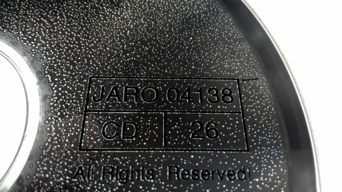
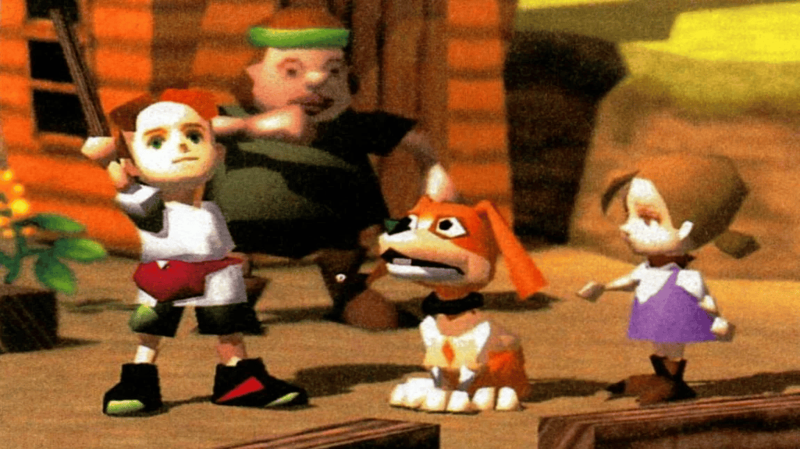
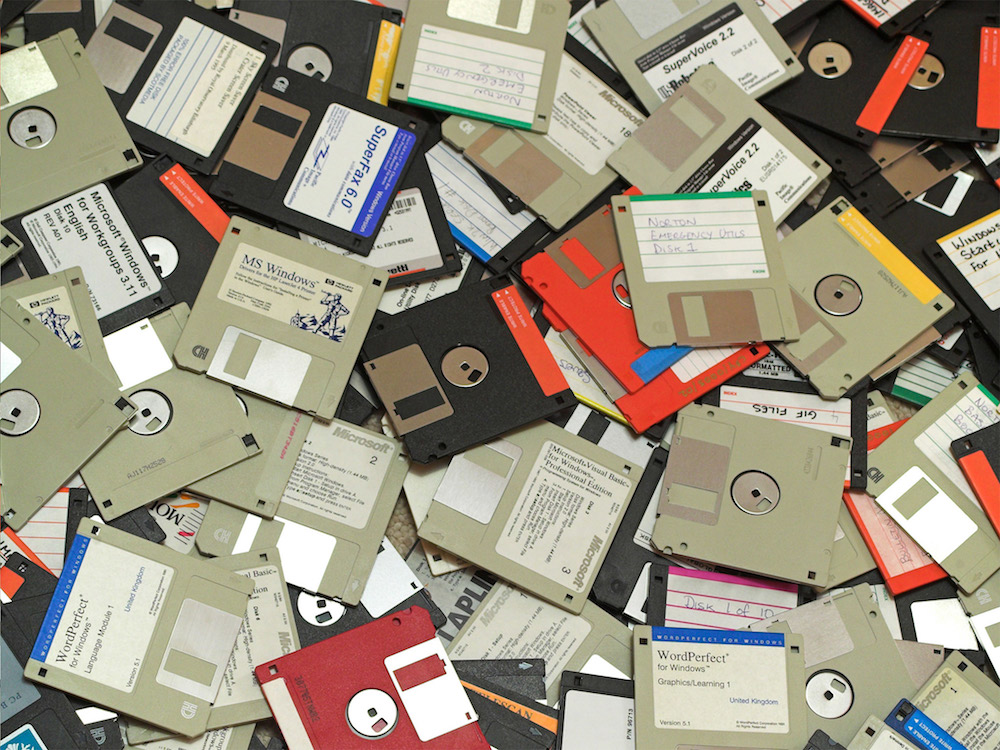
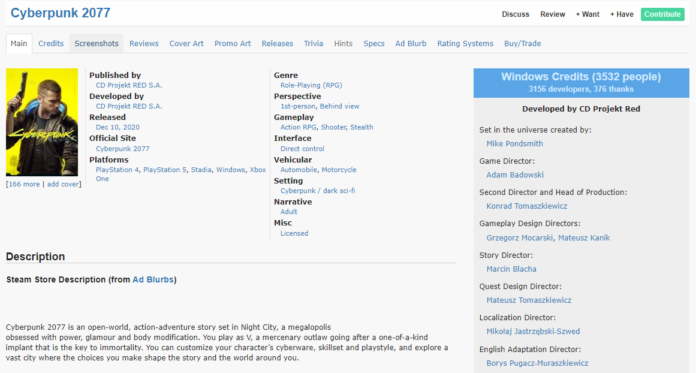

*This note was originally written for and published in [Press Over](https://pressover.news/opinion/abandonware-la-permanencia-del-autor/)*

As the arts mature, problems arise that complicate the preservation of certain works. All disciplines suffer the passage of time to a greater or lesser degree, but *when art is closely linked to the continuous advance of technology, as in our industry, those difficulties intensify*. There are specialists in painting restoration. Cinema has found the best ways to store celluloid and we see buildings under repair constantly, but meanwhile, many games are disappearing. Let's talk about abandonware.

### Abandonware? What is it?

When we talk about abandonware, we usually think of old consoles and CRT monitors, but in reality, the term refers to the **abandonment of any type of software by its developers or providers**. When this happens, users can lose technical support, the ability to buy, download, or even use the product, and sometimes, compatibility with new operating systems or hardware.

### Why does it happen?

While this stage usually occurs alongside the end of the program's life cycle, it can also be triggered by a company's bankruptcy or its exit from the market, in which case *the intellectual property can end up in a legal limbo from which it is very difficult to rescue it*, usually due to lack of legal documentation or the death of one of the rights holders.

Another possibility is that the company or product is bought, in which case the new owners can eliminate the availability of the software, and even legally pursue users' attempts to use and distribute it.

### Is preservation important?

All the applications that are part of our daily life are at risk of being abandoned, and with them, our information, our work, and in some cases, a part of our history can disappear. With video games in particular, we lose not only our past, but also that of our medium.

A particularity of software compared to other arts is that **its historical value lies not only in the final product**. The code can teach us how the title was made, who was behind it, and portray the creative process undergone. Unfortunately, many companies don't know this, or don't care, disposing of this information as if it were trash.

### What are the obstacles?

One of the biggest threats to the historical preservation of games is the *corruption of physical storage media*. In the early decades of gaming, most products were distributed on floppy disks or cartridges. Today we know the limits of these formats, and how the various environmental factors they are subject to, such as cosmic radiation and electromagnetic fields, can affect them. The reality is that their lifespan outside a controlled space is quite short.

This situation creates a sense of urgency, because while archivists try to solve legal problems and contact owners to make legal copies and distribute them, these games are degenerating. Even for owners, getting a version that is usable on current systems requires a lot of compatibility work.

### Where is abandonware archived?

Despite all these obstacles, there are many people **working to preserve, digitize, and make this slice of history functional in the best possible way**. One of the best-known companies in the field is Good Old Games, which is dedicated to legally re-releasing abandoned titles, but it's important to highlight the work of hundreds of non-profit pages created by the community to distribute ROMs, such as MyAbandonware.com, OldGamesDownload.com, and Archive.org.

Other sites specialize in rescuing the visual aspect, searching for advertisements, posters, magazines, and original boxes, and allowing contributions from all users, like MobyGames.com, which collects images of current works, along with their credits, information, and reviews, building the archive from the present, while possible.

If rights holders decide to sue any of these spaces, they may be forced to remove several items from their catalog, or shut down the page entirely. *The line between historical record and piracy is not precisely clear*, and it's up to each person to decide what they think is correct, but the reality is that in many cases, we are given no other alternative to obtain them legally.

### The Authors

When the legal management of a creation does not depend on the authors, their interests are usually left aside, without representation. So, it's important to ask ourselves: **What are those interests? Why do we make video games?** After discussing it with several developers, the conclusions we reached were these:

- Generate what we feel when falling in love with a game.
- Astonish, excite, surprise, and inspire the player.
- Transmit passion for the medium.
- Form or belong to a community.
- Create worlds and characters to empathize with.
- Leave a message through the story.
- Participate in a work that transcends and marks many people.
- Leave a record of our time, what we think, and how we live.
- Because it comes from within, because it's an impulse.

There are as many answers as there are people in the field, and each will identify with some more than others, but a common point is *transcendence, the idea of leaving a part of ourselves in the world*, for when we are no longer here. The existence of historical record platforms gives us back that promise.

Although we think that what goes on the internet stays there forever, even servers can fail. The only way to avoid abandonware and preserve what matters to us, be it our work, our art, or our personal information, is to start today.
