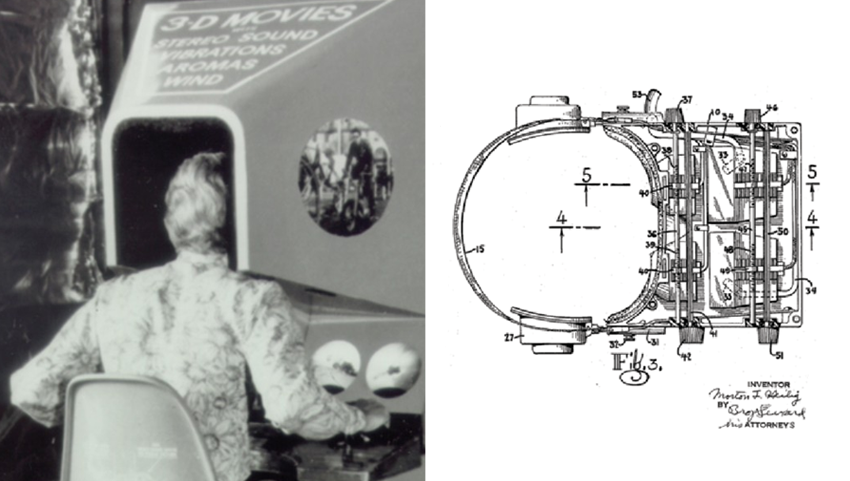
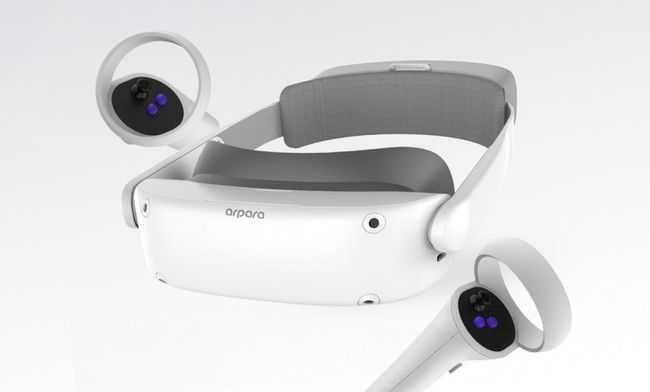
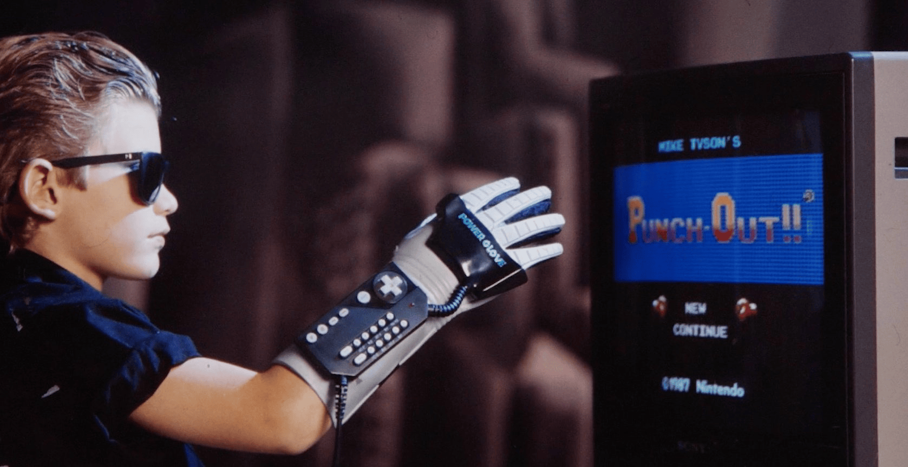

*Esta nota fue originalmente escrita para y publicada en [Press Over](https://pressover.news/articulos/realidad-virtual-un-futuro-contemporaneo/)*

La realidad virtual se encuentra en un lugar interesante. Como tecnología, por más que sigue en crecimiento, ya abandonó la fase de prototipado, pasando de experimento a realidad. **Los precios están empezando a bajar, con propuestas que apuntan claramente al mercado general**, y todos conocemos algunos juegos que hacen buen uso de las posibilidades que estos sistemas ofrecen. Si sumergimos un poco la cabeza, parece haber una industria aún en formación con un gran foco en la innovación.

### Un poco de Historia
Aunque empezamos a ver los primeros lentes funcionales orientados al usuario medio cerca de 2010, su existencia se basa en **más de 30 años de investigación y desarrollo**, en los que se crearon varios modelos dirigidos al uso industrial, en especial para entrenamiento aeroespacial y médico.

Es importante destacar que el progreso de la realidad virtual **depende de los avances en múltiples sectores**, como la mejora de los procesadores, la simplificación de los sistemas operativos, la creación de nuevos tipos de pantallas, entre otros. A esto se debe el gran salto temporal, las ideas existen hace mucho, pero no había forma de traerlas a la vida.

En 2012, Oculus saca su primer kit de desarrollo de software a través de Kickstarter, llamado Oculus Rift, diseñado por Palmer Luckey y John Carmack. Un año después, Facebook compra la empresa. Mientras tanto, Valve hace aportes significativos a la tecnología, poniendo en venta su primer casco en 2014, el Vive, junto a HTC. Estos acontecimientos generan un crecimiento en el interés de otras compañías que se sostiene hasta el presente.

Uno de los saltos más grandes hacia la popularización y adopción en el mainstream de la realidad virtual se da en 2020, a través del lanzamiento del Oculus Quest 2. Este producto reúne todas las características importantes del medio, pero elimina la necesidad de cables y disminuye su precio a la mitad de sus predecesores, 300 dólares. Es hasta la fecha el dispositivo VR más exitoso, y contempla el 80% de las ventas de 2021.

### Actualidad
Aunque aún queda camino por recorrer hasta ver a la realidad virtual como parte de nuestro día a día, ya contamos con un ecosistema funcional y asentado. Si antes el progreso estaba estrechamente ligado a las posibilidades que nos daba el hardware, hoy la evolución radica en las aplicaciones que le podemos dar a los lentes a través del software.

Es imposible saber a ciencia cierta cómo estas utilidades van a afectar nuestra vida en el futuro, pero podemos analizar las últimas novedades para estar al tanto y entender un poco mejor de qué manera podemos llegar a emplearlas.

Una de las discusiones más fuertes que se está dando sobre VR tiene que ver con la *forma en la que interactuamos con el mundo digital*. Dentro de este debate, hay dos corrientes con mucha fuerza, la captura de movimiento, y las interfaces cerebro-máquina.

### Captura de Movimiento
Si tomamos una acción básica, como levantar un lápiz, y la transportamos al entorno virtual, podemos empezar a pensar cuál sería la forma más intuitiva de llevarla a cabo. La respuesta que viene dando la industria desde hace años ha sido usar nuestro cuerpo. En este caso, tan solo haría falta dirigir nuestra mano física hacia el lápiz virtual, cerrarla y levantarlo. Ahora, **¿Cómo recopilamos ese movimiento?**

La solución ya establecida a esta problemática es usar un control especial. Cada empresa ha propuesto su propio diseño, con sus particularidades, y el usuario es el encargado de decidir cuál le resulta más atractivo. El Valve Index, por ejemplo, usa un joystick que no hay que sostener, algo similar a un guante con botones, mientras que otras opciones son parecidas a un Wii Remote. También existe una escena que propone *alternativas DIY (hazlo tú mismo), muy centrada en la impresión 3D y la programación*.

Esta es una forma adecuada de trackear nuestras manos, pero no nos permite usar el resto de nuestro cuerpo. Acá es donde entra el full body tracking, que interpreta todo lo que hacemos usando cámaras situadas en lugares específicos de la habitación junto con sensores corporales. Por ahora no hay muchas aplicaciones que hagan uso de esta funcionalidad por fuera de la interpretación y actuación en salas de chat.

Es relevante destacar que varios cascos integran cámaras hacia el exterior, que nos permiten usar nuestras manos reales, sin controles, para interactuar con el mundo digital. En los últimos meses se han hecho progresos significativos en este campo, pero todavía hay pocos programas que lo incorporen efectivamente.

### Interfaces Cerebro-Máquina
La otra posibilidad que se empieza a gestar es el uso de interfaces que interpretan la actividad cerebral y la utilizan como input. Por ahora, están en un estado muy experimental y las aplicaciones solo permiten concentrarse en un punto muy específico de la pantalla para realizar una acción, pero es interesante verlo en funcionamiento y entender que ya existe.

La iniciativa forma parte de una corriente dentro de la realidad virtual llamada “full dive”, que busca *tener una experiencia lo más similar posible a la vida real*, sin joysticks ni movimiento por parte del usuario. Estos dispositivos son el primer paso hacia ese futuro, y con la aparición de proyectos como NeuraLink, el avance en esta área no parece imposible.

El VR aún tiene muchos problemas que solucionar hasta volverse parte de nuestras vidas. Principalmente, los precios y la necesidad de un espacio relativamente grande en el que movernos libremente lo hacen mucho menos atractivo que otras tecnologías más cercanas, pero al ver el crecimiento que está teniendo, estar al tanto de las novedades nos puede servir para no quedarnos afuera, en especial en el caso de desarrolladores y artistas, **vale la pena pegarle una mirada**.