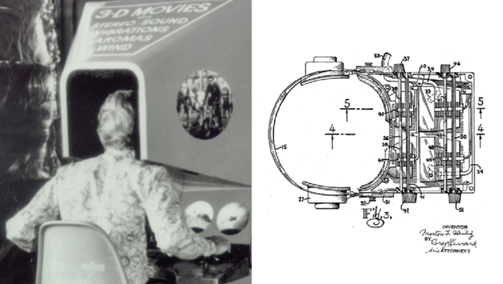
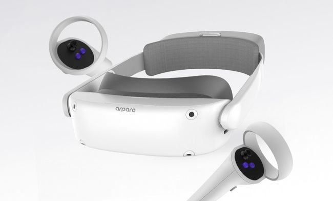
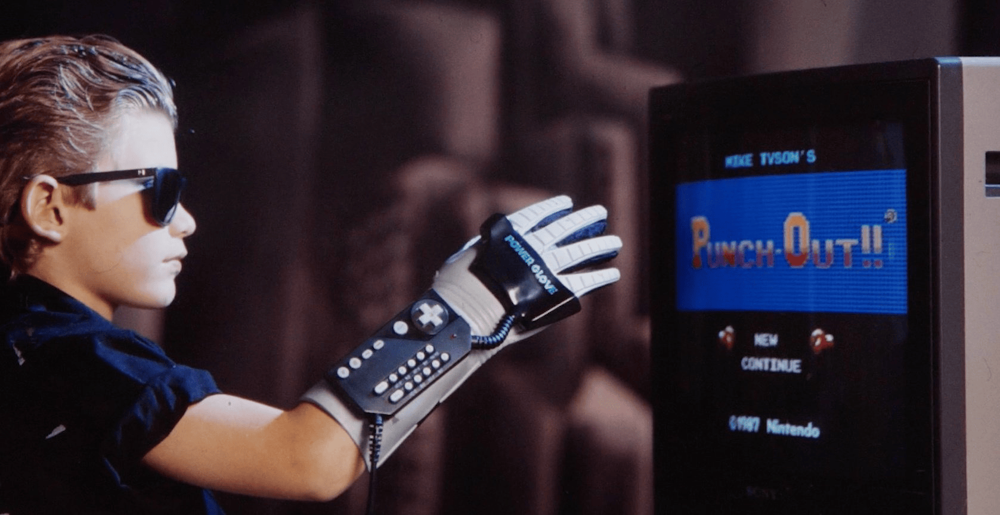

*This note was originally written for and published in [Press Over](https://pressover.news/articulos/realidad-virtual-un-futuro-contemporaneo/)*

Virtual reality is in an interesting place. As a technology, although still growing, it has already left the prototyping phase, moving from experiment to reality. **Prices are starting to drop, with proposals clearly aimed at the general market**, and we all know some games that make good use of the possibilities these systems offer. If we dip our heads in a bit, there seems to be an industry still in formation with a strong focus on innovation.

### A Bit of History

Although we began to see the first functional headsets aimed at the average user around 2010, their existence is based on *more than 30 years of research and development*, in which several models were created for industrial use, especially for aerospace and medical training.

It's important to note that the progress of virtual reality **depends on advances in multiple sectors**, such as processor improvement, operating system simplification, the creation of new types of screens, among others. This accounts for the great temporal leap; the ideas have existed for a long time, but there was no way to bring them to life.

In 2012, Oculus released its first software development kit through Kickstarter, called Oculus Rift, designed by Palmer Luckey and John Carmack. A year later, Facebook bought the company. Meanwhile, Valve made significant contributions to the technology, putting its first headset on sale in 2014, the Vive, together with HTC. These events generated *growth in interest from other companies* that continues to the present.

One of the biggest leaps towards the popularization and mainstream adoption of virtual reality occurred in 2020, through the launch of the Oculus Quest 2. This product brings together all the important features of the medium, but eliminates the need for cables and reduces its price to half of its predecessors, 300 dollars. It is to date the most successful VR device, accounting for 80% of 2021 sales.

### Present Day

Although there is still a way to go before virtual reality becomes part of our daily lives, **we already have a functional and established ecosystem**. If before progress was closely tied to the possibilities hardware gave us, today evolution lies in the applications we can give the headsets through software.

It's impossible to know for certain how these utilities will affect our lives in the future, but we can analyze the latest developments to stay informed and better understand how we might use them.

One of the strongest discussions taking place about VR has to do with the *way we interact with the digital world*. Within this debate, there are two strong currents: motion capture, and brain-computer interfaces.

### Motion Capture

If we take a basic action, like picking up a pencil, and transport it to the virtual environment, we can start thinking about what the most intuitive way to carry it out would be. The answer the industry has been giving for years has been to use our body. In this case, we would only need to direct our physical hand towards the virtual pencil, close it, and lift it. Now, **how do we capture that movement?**

The already established solution to this problem is to use a special controller. Each company has proposed its own design, with its particularities, and the user is the one who decides which one they find most attractive. The Valve Index, for example, uses a joystick that doesn't need to be held, something similar to a glove with buttons, while other options are similar to a Wii Remote. There is also a scene that proposes *DIY (do it yourself) alternatives, heavily focused on 3D printing and programming*.

This is an adequate way to track our hands, but it doesn't allow us to use the rest of our body. This is where full body tracking comes in, which interprets everything we do using cameras placed in specific locations in the room along with body sensors. For now, there aren't many applications that make use of this functionality outside of performance and acting in chat rooms.

It's relevant to note that several headsets integrate **outward-facing cameras, which allow us to use our real hands**, without controllers, to interact with the digital world. In recent months, significant progress has been made in this field, but there are still few programs that effectively incorporate it.

### Brain-Computer Interfaces

The other possibility that is beginning to take shape is the use of interfaces that interpret brain activity and use it as input. For now, they are in a very experimental state and applications only allow focusing on a very specific point on the screen to perform an action, but it's interesting to see it working and understand that it already exists.

The initiative is part of a current within virtual reality called "full dive", which seeks *to have an experience as similar to real life as possible*, without joysticks or movement by the user. These devices are the first step towards that future, and with the emergence of projects like NeuraLink, progress in this area doesn't seem impossible.

VR still has many problems to solve before becoming part of our lives. Mainly, the prices and the need for a relatively large space to move freely make it much less attractive than other more accessible technologies, but seeing the growth it's experiencing, staying on top of the news can help us not get left out, especially for developers and artists, **it's worth taking a look**.
