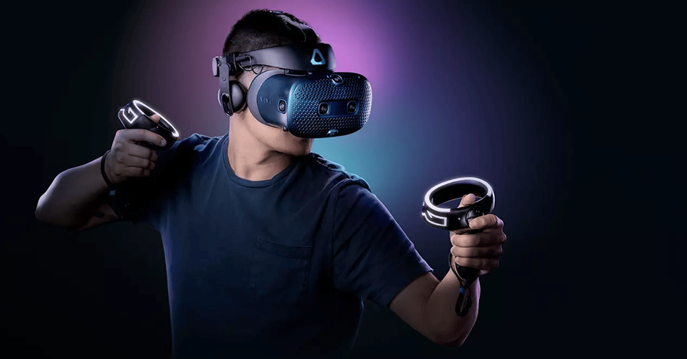
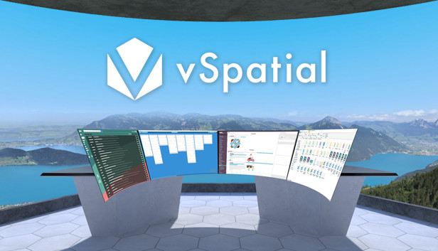
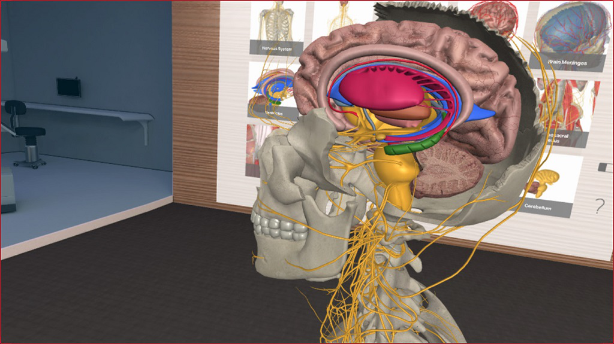
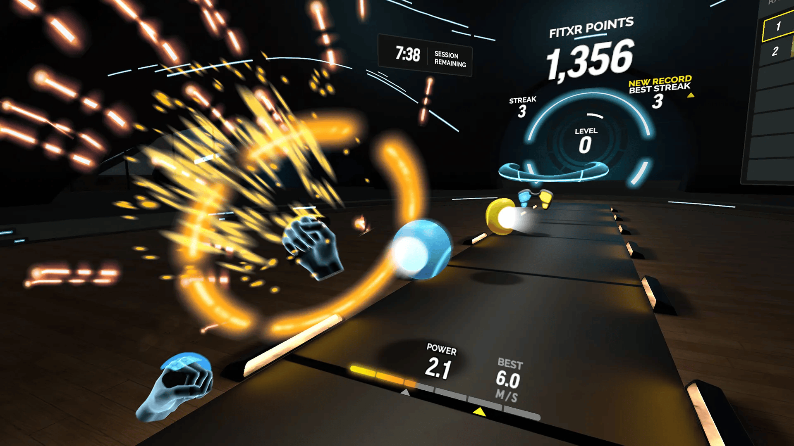
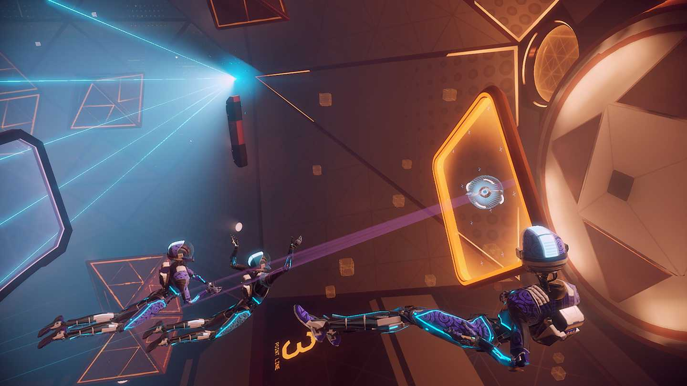

*Esta nota fue originalmente escrita para y publicada en [Press Over](https://pressover.news/articulos/realidad-virtual-las-mejores-aplicaciones/)*

Cuando se habla de realidad virtual, se suele hacer énfasis en el estado actual del hardware, discutiendo los últimos avances y analizando los productos más nuevos. Si bien es importante tener una idea básica de lo que la tecnología permite para entender el fenómeno, **el software parece quedar en segundo plano, cuando en realidad es lo que nos permite incorporarlo a nuestras vidas**.

Dentro de la comunidad conviven muchos tipos de usuarios que tienen distintos objetivos a la hora de ponerse el casco. Aunque gran parte se centra en los videojuegos, también existen personas que buscan aplicaciones basadas en la productividad, socialización, expresión artística e incluso la exploración de nuevas formas de ejercitarse.

Algo a tener en cuenta es que hay alternativas para cada uno de los servicios en la lista. Priorizamos la calidad y que se pueda utilizar en la mayoría de los dispositivos, pero si buscás, vas a encontrar muchas más. Para los precios en Steam, te recomendamos el uso de [Steamcito](https://steamcito.com.ar/), una extensión que calcula el coste final sumando los impuestos.

### Productividad

Uno de los apartados más interesantes es el de la **productividad**. Si deseás adaptar la realidad virtual a tu día a día, hay varias propuestas llamativas.

[vSpatial](https://www.meta.com/experiences/vspatial/2540393919317658/?utm_source=pressover.news&utm_medium=oculusredirect) y [Virtual Desktop](https://www.vrdesktop.net/): Estas aplicaciones permiten *llevar tu escritorio al entorno virtual* y adaptarlo como quieras, sin perder acceso a tus archivos y programas. ¿Querés tener un monitor para cada ventana abierta? ¿Agrandar tus pantallas para ver una película desde las estrellas? Podés hacerlo. vSpatial es gratuita, con un servicio de suscripción que no es necesario en la mayoría de usos, y Virtual Desktop está a 180 pesos en Steam.

[Sketchbox](https://www.sketchbox3d.com/): Si anhelás un entorno de diseño colaborativo, Sketchbox tiene muchas características útiles. La idea es trabajar con varias personas en la creación de un modelo tridimensional para luego exportarlo a motores como Unity o Unreal. Es gratuito, pero solo está disponible para cascos Rift y Vive.

[Noda](https://noda.io/) y [Softspace](https://www.spaceframe.xyz/): Otro pilar de la productividad es la organización, y especialmente en labores creativas es difícil mantener un sistema en pie. Estas herramientas se centran en la creación de nodos, contenedores de notas o imágenes que podemos situar e interconectar en el espacio, creando una especie de **red de pensamientos**. Ambas son gratuitas y están disponibles en Steam.

### Expresión Artística

Una de las particularidades de la realidad virtual es la posibilidad de *cambiar tu perspectiva* de la misma forma en la que lo harías en la vida real. En las artes, esta variable da lugar a una nueva manera de interactuar con tu obra y su proceso, especialmente en las artes visuales y la producción musical.

[Tilt Brush](https://store.steampowered.com/app/327140/Tilt_Brush/) y [Gravity Sketch](https://www.gravitysketch.com/): En pocas palabras, MS Paint en tres dimensiones. Si bien son muy similares, Tilt Brush se convirtió en el estándar por su accesibilidad. Gravity Sketch apunta especialmente a diseñadores y artistas del ámbito industrial, contando con más herramientas para la creación de modelos profesionales. Las dos están disponibles en Steam, Tilt Brush cuesta 225 pesos y Gravity Sketch es gratuita.

[SynthVR](https://store.steampowered.com/app/1517890/SynthVR/) y [Synthspace](https://store.steampowered.com/app/1355640/SYNTHSPACE/): La síntesis modular es un mundo en el que cuesta entrar, tanto por los elevados precios como por la dificultad. Con esta aplicación vas a poder aprender por tu cuenta conectando cables, girando perillas y agregando todos los módulos que quieras. Synthspace también tiene un “tutorial” en el que te enseña lo básico. Ambas están en Steam, SynthVR por 280 pesos y Synthspace por 330 pesos.

[DMT: Dynamic Music Tesseract](https://store.steampowered.com/app/648890/DMT_Dynamic_Music_Tesseract/): Aunque el objetivo de este visualizador de música no es la expresión, si extrañás los plugins de Winamp o las animaciones del Windows Media Player te generan nostalgia, entonces esta app te va a gustar. La idea es la misma, poner tu álbum favorito y relajarte mirando los patrones que se van generando. La encontrás en Steam por 68 pesos.

### Educación

Un campo todavía poco explorado pero con mucho potencial es el de la educación. En especial, el gran atractivo que propone el uso de la realidad virtual es el de aprender en un espacio seguro **tareas que podrían ser peligrosas o de difícil acceso**.

[3D Organon VR Anatomy](https://store.steampowered.com/app/1081730/3D_Organon_XR/?l=spanish): Tanto para estudiantes como para curiosos, la posibilidad de ver el cuerpo humano por dentro, capa por capa, con nombres y explicaciones, es fascinante. Esta aplicación es completamente gratuita y está en Steam, así que podes pegarle una mirada sin ningún compromiso.

[Google Earth VR](https://arvr.google.com/): Viajar por el mundo usando Street View ya es, en su formato estándar, una experiencia interesante. La realidad virtual solo amplifica esa sensación aún más, convirtiéndonos en un espectador omnisciente. Todo el tiempo se añaden lugares nuevos, y funcionalidades como las fotos 360° nos permiten ver algunos paisajes en mejor calidad. Una de las novedades es la opción de sobrevolar un terreno en vez de caminar por él.

[VR Museum Of Fine Arts](https://store.steampowered.com/app/515020/The_VR_Museum_of_Fine_Art/): En este caso vamos a estar visitando un museo con esculturas y pinturas a escala 1:1, todo en el mismo lugar y sin ningún tipo de barrera. Podes acercarte y ver con muchísimo detalle algunas de las obras más famosas, sin guardias controlando o barreras de vidrio. Está disponible gratis en Steam y se suman nuevas obras constantemente, así que vale la pena entrar un ratito.

[Short Circuit VR](https://store.steampowered.com/app/970800/Short_Circuit_VR/): Para alguien que busca aprender lo básico sobre electrónica, con el objetivo de completar algún proyecto o simplemente por hobby, comprar componentes y estudiar de la forma tradicional puede ser demasiado compromiso. Short Circuit propone un laboratorio con todo lo que necesitás para aprender o probar algún prototipo antes de llevarlo a la vida real. También incluye “retos” que funcionan a modo de tutorial. Por ahora se encuentra en early access y es gratuito en Steam.

### Fitness

Aunque esta categoría es un poco más controversial, hay un gran interés en ver cómo *la interacción con estímulos digitales afecta a la motivación y el ejercicio físico*. Usar las métricas de nuestro cuerpo, como las pulsaciones, para adaptar el entrenamiento en tiempo real es, posiblemente, el atractivo principal.

[FitXR](https://fitxr.com/): Mecánicamente, es similar a Beat Saber, pero en vez de un sable, usamos nuestros puños para pegarle a los bloques que van apareciendo en pantalla. La gran diferencia es que FitXR intenta mantenernos en un ritmo cardíaco elevado, mientras que otros juegos rítmicos dependen de la canción que elijamos. Aunque tiene contenido gratuito, la experiencia completa está basada en un servicio de suscripción.

[Dance Central](https://www.meta.com/experiences/dance-central/2453152771391571/?utm_source=pressover.news&utm_medium=oculusredirect): Parte clases de baile, parte ejercicio, Dance Central establece una pequeña historia y un elenco de personajes con quienes podemos practicar, y eventualmente formar una amistad. Un punto a destacar es que controlamos el juego a través de un celular, al que también nos llegan mensajes. Lamentablemente sólo está disponible para Oculus Quest, y tiene un precio de 30 dólares.

### Redes Sociales

[BigScreen](https://www.bigscreenvr.com/): Si lo único que necesitás es una habitación para compartir con tus amigos, y una pantalla grande para pasar series o películas, tenés muchas opciones para elegir. De todas, BigScreen es la que cuenta con más posibilidades e integraciones. Es gratuita, está disponible en todos los dispositivos, y está en Steam.

[VRChat](https://hello.vrchat.com/): Si tu objetivo es conocer gente a través de la realidad virtual, VRChat es el mejor espacio. Tiene una comunidad inmensa, con salas y eventos de todo tipo, gente pasando música, y te vas a encontrar con muchas situaciones graciosas. Hay muchas salas en español, pero también es una buena oportunidad para practicar otros idiomas. Es gratuita y está disponible en todos los dispositivos.

### Videojuegos

Por fuera de algunas experiencias cinemáticas cortas, como Vader Immortal o Batman Arkham VR, o juegos que no fueron pensados para la realidad virtual pero permiten esa opción, como Minecraft, Skyrim o Resident Evil 4, hay muchos títulos que vale la pena investigar, diseñados para hacer un **gran uso de las características del formato**.

[Boneworks](https://store.steampowered.com/app/823500/BONEWORKS/?l=spanish): Una de las IPs más grandes que arrancaron dentro del VR y que ya anunció DLC, Boneworks es de lo mejor hasta la fecha mecánicamente, con uno de los mejores combates, y puzzles que hacen uso de las físicas a fondo. Tiene una buena historia y fue la razón por la cual Valve decidió hacer Half-Life: Alyx. Está en Steam por 330 pesos.

[Lone Echo VR](https://www.meta.com/es-es/experiences/echo-vr/2215004568539258/?utm_source=pressover.news&utm_medium=oculusredirect): Lone Echo propone una experiencia cinemática de suspenso en un mundo de ciencia ficción espacial. Poco se puede decir sin hacer spoiler, pero también cuenta con un modo multijugador competitivo basado en las batallas de Ender’s Game. Ambos están disponibles únicamente en Oculus Quest, y mientras que el multijugador es gratuito, el modo historia cuesta 20 dólares.

[Superhot VR](https://store.steampowered.com/app/617830/SUPERHOT_VR/): De los pocos juegos que no se diseñaron pensando en la realidad virtual, pero que parecen hechos para este formato. Vamos a ir pasando por muchos escenarios de pelea centrados en una mecánica muy simple, el tiempo sólo pasa cuando nos movemos. El juego está en Steam y sale 500 pesos.

Para cerrar, una última recomendación: Evita comprar en las tiendas “de marca”. Lamentablemente, la mejor opción es Steam, porque *vas a tener la posibilidad de usar tus juegos en cualquier otro casco*. En cambio, si usas, por ejemplo, la tienda de Oculus, y a futuro decidís cambiarte a Vive, no vas a tener acceso a tus aplicaciones. ¡Esperamos que te sirva!