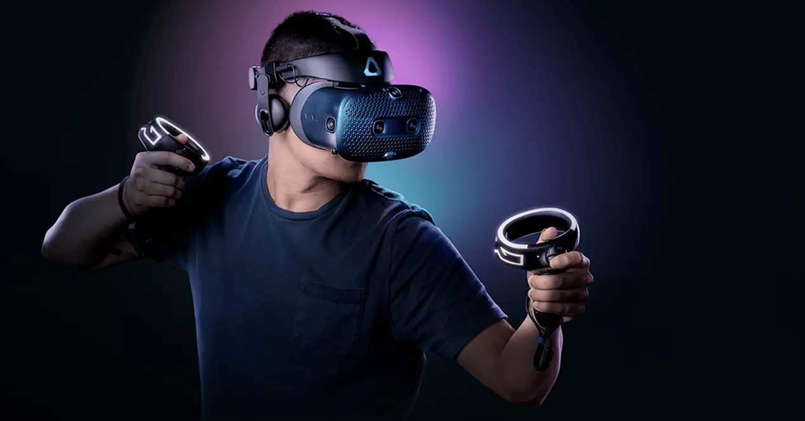
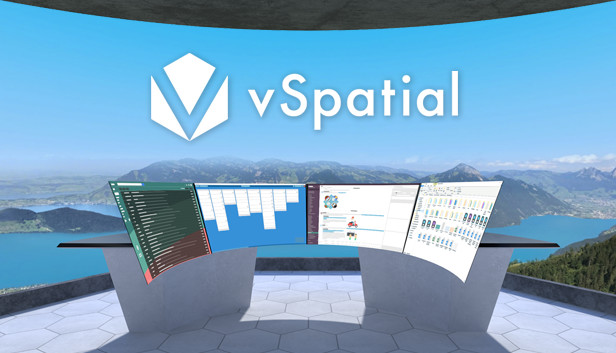
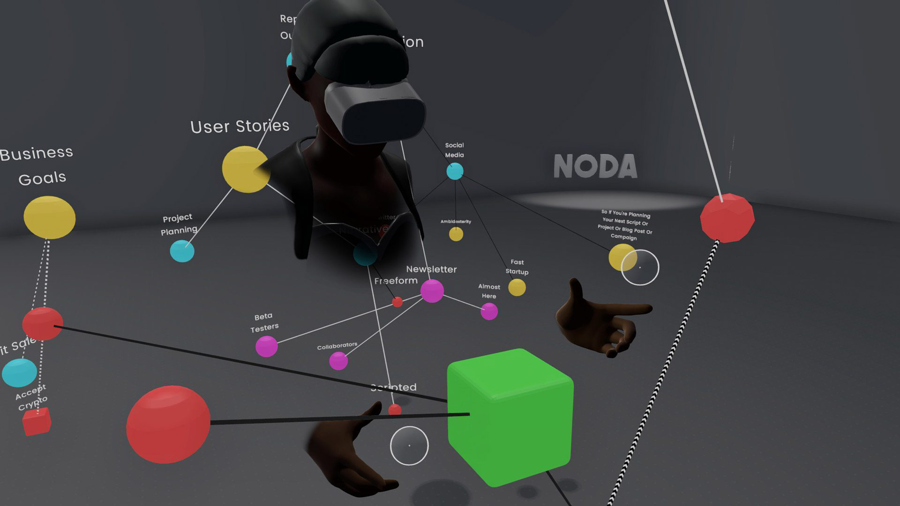
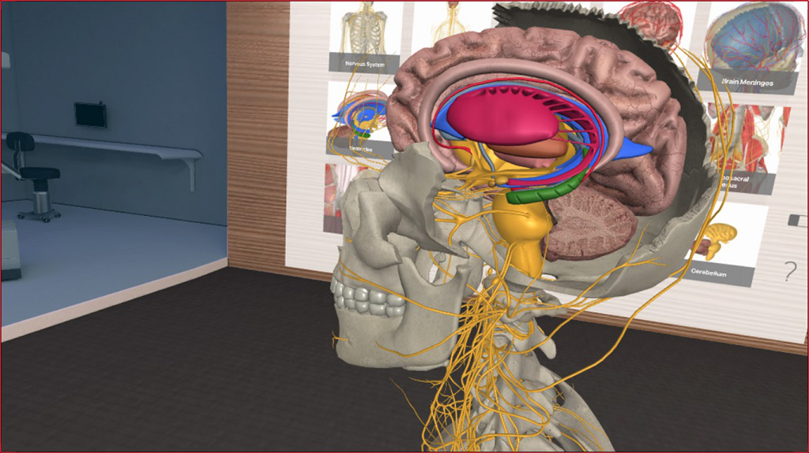
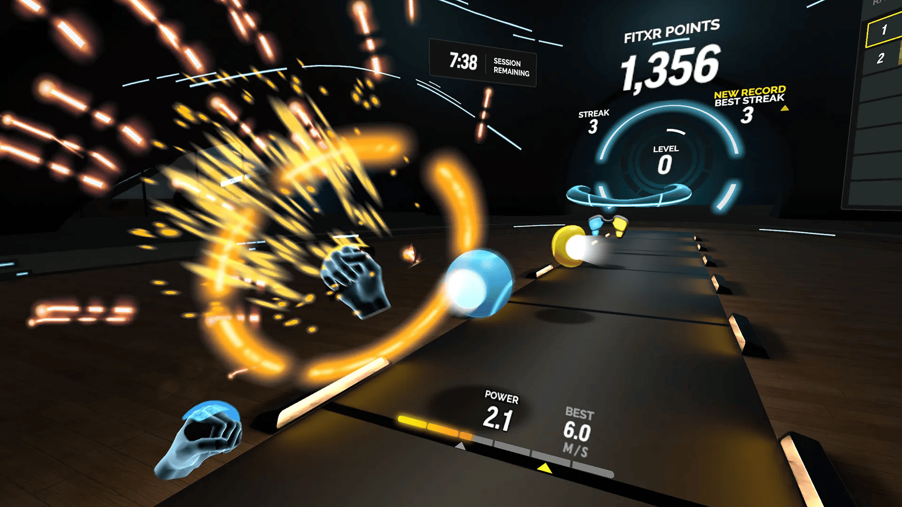
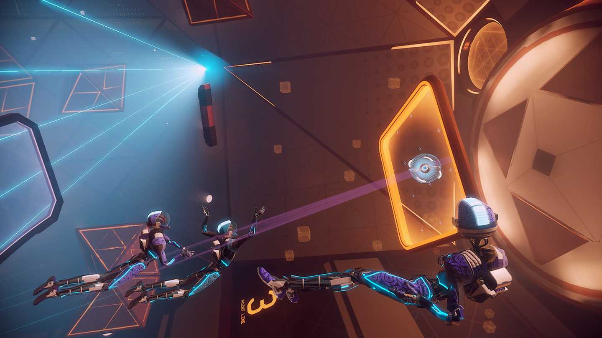

*This note was originally written for and published in [Press Over](https://pressover.news/articulos/realidad-virtual-las-mejores-aplicaciones/)*

When talking about virtual reality, emphasis is often placed on the current state of hardware, discussing the latest advances and analyzing the newest products. While it's important to have a basic idea of what the technology allows in order to understand the phenomenon, **the software seems to take a back seat, when in reality it's what allows us to incorporate it into our lives**.

Within the community, many types of users coexist with different goals when putting on the headset. Although a large part focuses on video games, there are also people looking for applications based on productivity, socializing, artistic expression, and even exploring new ways to exercise.

Something to keep in mind is that there are alternatives for each of the services on the list. We prioritized quality and usability on most devices, but if you search, you'll find many more. For Steam prices, we recommend using [Steamcito](https://steamcito.com.ar/), an extension that calculates the final cost including taxes.

### Productivity

One of the most interesting sections is **productivity**. If you want to adapt virtual reality to your daily life, there are several appealing proposals.

[vSpatial](https://www.meta.com/experiences/vspatial/2540393919317658/?utm_source=pressover.news&utm_medium=oculusredirect) and [Virtual Desktop](https://www.vrdesktop.net/): These applications allow you to *bring your desktop to the virtual environment* and adapt it however you want, without losing access to your files and programs. Want a monitor for each open window? Want to enlarge your screens to watch a movie from the stars? You can do it. vSpatial is free, with a subscription service that isn't necessary for most uses, and Virtual Desktop is available on Steam.

[Sketchbox](https://www.sketchbox3d.com/): If you long for a collaborative design environment, Sketchbox has many useful features. The idea is to work with several people in creating a three-dimensional model for later export to engines like Unity or Unreal. It's free, but only available for Rift and Vive headsets.

[Noda](https://noda.io/) and [Softspace](https://www.spaceframe.xyz/): Another pillar of productivity is organization, and especially in creative work it's difficult to maintain a system. These tools focus on creating nodes, containers for notes or images that we can place and interconnect in space, creating a kind of **thought network**. Both are free and available on Steam.

### Artistic Expression

One of the particularities of virtual reality is the possibility of *changing your perspective* in the same way you would in real life. In the arts, this variable gives rise to a new way of interacting with your work and its process, especially in visual arts and music production.

[Tilt Brush](https://store.steampowered.com/app/327140/Tilt_Brush/) and [Gravity Sketch](https://www.gravitysketch.com/): Simply put, MS Paint in three dimensions. While very similar, Tilt Brush became the standard for its accessibility. Gravity Sketch targets designers and artists in the industrial field specifically, with more tools for professional model creation. Both are available on Steam.

[SynthVR](https://store.steampowered.com/app/1517890/SynthVR/) and [Synthspace](https://store.steampowered.com/app/1355640/SYNTHSPACE/): Modular synthesis is a world that's hard to enter, both due to high prices and difficulty. With this application you can learn on your own by connecting cables, turning knobs, and adding as many modules as you want. Synthspace also has a "tutorial" that teaches you the basics. Both are on Steam.

[DMT: Dynamic Music Tesseract](https://store.steampowered.com/app/648890/DMT_Dynamic_Music_Tesseract/): Although the goal of this music visualizer isn't expression, if you miss Winamp plugins or Windows Media Player animations make you nostalgic, then this app is for you. The idea is the same, put on your favorite album and relax watching the patterns that generate. You can find it on Steam.

### Education

A field still little explored but with great potential is education. In particular, the great appeal of using virtual reality is learning in a safe space **tasks that could be dangerous or difficult to access**.

[3D Organon VR Anatomy](https://store.steampowered.com/app/1081730/3D_Organon_XR/?l=spanish): For both students and the curious, the possibility of seeing the human body from the inside, layer by layer, with names and explanations, is fascinating. This application is completely free and on Steam, so you can take a look without any commitment.

[Google Earth VR](https://arvr.google.com/): Traveling the world using Street View is already, in its standard format, an interesting experience. Virtual reality only amplifies that feeling even more, turning us into an omniscient spectator. New places are constantly being added, and features like 360° photos allow us to see some landscapes in better quality. One of the new features is the option to fly over terrain instead of walking through it.

[VR Museum Of Fine Arts](https://store.steampowered.com/app/515020/The_VR_Museum_of_Fine_Art/): In this case, we'll be visiting a museum with sculptures and paintings at 1:1 scale, all in the same place and without any barriers. You can get close and see some of the most famous works in great detail, without guards watching or glass barriers. It's available for free on Steam and new works are constantly being added, so it's worth dropping in for a bit.

[Short Circuit VR](https://store.steampowered.com/app/970800/Short_Circuit_VR/): For someone looking to learn the basics of electronics, with the goal of completing a project or just as a hobby, buying components and studying the traditional way can be too much commitment. Short Circuit proposes a lab with everything you need to learn or test a prototype before bringing it to real life. It also includes "challenges" that work as a tutorial. It's currently in early access and free on Steam.

### Fitness

Although this category is a bit more controversial, there is great interest in seeing how *interaction with digital stimuli affects motivation and physical exercise*. Using our body metrics, like heart rate, to adapt training in real time is possibly the main appeal.

[FitXR](https://fitxr.com/): Mechanically, it's similar to Beat Saber, but instead of a saber, we use our fists to hit the blocks that appear on screen. The big difference is that FitXR tries to keep us at an elevated heart rate, while other rhythm games depend on the song we choose. Although it has free content, the full experience is based on a subscription service.

[Dance Central](https://www.meta.com/experiences/dance-central/2453152771391571/?utm_source=pressover.news&utm_medium=oculusredirect): Part dance class, part exercise, Dance Central establishes a small story and a cast of characters with whom we can practice, and eventually form a friendship. A notable point is that we control the game through a cell phone, which also receives messages. Unfortunately it's only available for Oculus Quest, and costs 30 dollars.

### Social Networks

[BigScreen](https://www.bigscreenvr.com/): If all you need is a room to share with your friends, and a big screen to watch shows or movies, you have many options to choose from. Of all, BigScreen has the most possibilities and integrations. It's free, available on all devices, and on Steam.

[VRChat](https://hello.vrchat.com/): If your goal is to meet people through virtual reality, VRChat is the best space. It has an immense community, with rooms and events of all kinds, people playing music, and you'll find many funny situations. There are many Spanish-speaking rooms, but it's also a good opportunity to practice other languages. It's free and available on all devices.

### Video Games

Aside from some short cinematic experiences, like Vader Immortal or Batman Arkham VR, or games not originally designed for virtual reality but that allow the option, like Minecraft, Skyrim, or Resident Evil 4, there are many titles worth investigating, designed to make **great use of the format's features**.

[Boneworks](https://store.steampowered.com/app/823500/BONEWORKS/?l=spanish): One of the biggest IPs that started within VR and has already announced DLC, Boneworks is one of the best to date mechanically, with top-tier combat and puzzles that make thorough use of physics. It has a good story and was the reason Valve decided to make Half-Life: Alyx. It's on Steam.

[Lone Echo VR](https://www.meta.com/es-es/experiences/echo-vr/2215004568539258/?utm_source=pressover.news&utm_medium=oculusredirect): Lone Echo proposes a suspenseful cinematic experience in a space science fiction world. Little can be said without spoiling, but it also features a competitive multiplayer mode based on Ender's Game battles. Both are available only on Oculus Quest, and while the multiplayer is free, the story mode costs 20 dollars.

[Superhot VR](https://store.steampowered.com/app/617830/SUPERHOT_VR/): One of the few games that wasn't designed with virtual reality in mind, but seems made for this format. We'll go through many combat scenarios centered on a very simple mechanic: time only moves when we move. The game is on Steam.

To close, one last recommendation: Avoid buying from "brand" stores. Unfortunately, the best option is Steam, because *you'll have the possibility to use your games on any other headset*. If you use, for example, the Oculus store, and in the future decide to switch to Vive, you won't have access to your applications. We hope it helps!
